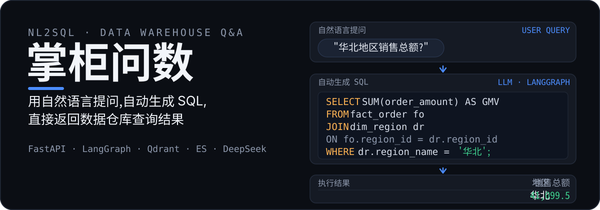
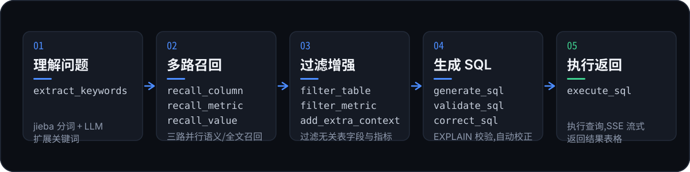
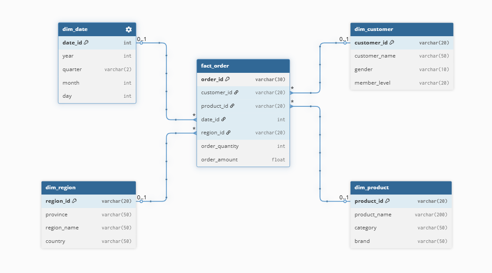
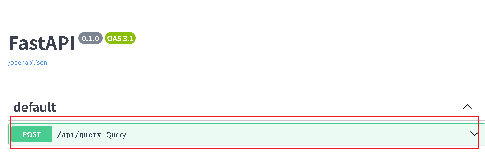

<p align="center">
  
</p>

**掌柜问数**是一个面向数据仓库的 **NL2SQL 智能问数系统**:不懂 SQL 的业务人员也能用自然语言直接提问,系统自动理解问题、召回元数据、生成并校验 SQL,执行后把结果以表格形式流式返回。

> 本质上是一个 **DB-RAG** 流程:先把数据仓库的元数据(表、字段、指标、字段取值)结构化存储并建立向量/全文索引,再在提问时多路召回相关元数据,交给大模型生成 SQL。

## 效果演示

以下为真实运行效果(问题 → 生成 SQL → 结果表格):

<p align="center">
  
  
</p>

<p align="center">
  
  
</p>

<details>
<summary>查看「华北地区销售总额」自动生成的 SQL</summary>

```sql
select sum(`dw2`.`fo`.`order_amount`) AS `GMV`
from `dw2`.`fact_order` `fo`
         join `dw2`.`dim_region` `dr`
where ((`dw2`.`fo`.`region_id` = `dw2`.`dr`.`region_id`) and (`dw2`.`dr`.`region_name` = '华北'))
```

</details>

## 工作原理

问数智能体由 LangGraph 编排,一次提问经过五个阶段:

<p align="center">
  
</p>

| 阶段 | 节点 | 说明 |
| --- | --- | --- |
| 理解问题 | `extract_keywords` | jieba TF-IDF 抽取关键词,再由 LLM 语义扩展 |
| 多路召回 | `recall_column` · `recall_metric` · `recall_value` | Qdrant 语义召回字段与指标,ES 全文召回字段取值 |
| 过滤增强 | `merge_retrieved_info` · `filter_table` · `filter_metric` · `add_extra_context` | 合并三路结果,LLM 过滤无关表/字段/指标,补充时间与库上下文 |
| 生成 SQL | `generate_sql` · `validate_sql` · `correct_sql` | 生成 SQL,`EXPLAIN` 校验,失败自动校正 |
| 执行返回 | `execute_sql` | 执行查询,SSE 流式返回结果 |

## 核心特性

- **自然语言问数**:直接问「华北地区销售总额」「各地区销量排名前三的商品」,不用写 SQL
- **多路召回**:字段/指标走 Qdrant 向量召回,字段取值走 ES 全文召回,LLM 扩展关键词兜底
- **SQL 可控生成**:基于召回元数据生成 SQL,`EXPLAIN` 校验,出错自动校正后再执行
- **SSE 流式反馈**:实时推送执行阶段与查询结果,前端展示进度与结果表格
- **统一元数据知识库**:MySQL 结构化存储 + 向量索引 + 全文索引
- **工程化**:YAML 配置、全异步客户端、请求级日志(request_id)

## 技术栈

| 分类 | 技术 |
| --- | --- |
| 后端 | FastAPI · Uvicorn · SQLAlchemy · asyncmy |
| 智能体 | LangGraph · LangChain · DeepSeek / Qwen |
| 检索 | Qdrant(向量)· Elasticsearch(全文)· TEI + BGE-large-zh-v1.5 |
| 存储 | MySQL(dw 数据仓库 + meta 元数据库) |
| 前端 | Vue 3 + Vite(SSE 流式问答) |
| 基础设施 | Docker Compose(MySQL · Qdrant · ES · Kibana · TEI) |
| 工程 | uv · OmegaConf · Loguru · jieba |

## 快速开始

环境要求:Python 3.12+、Node.js ≥ v22、Docker Compose、DeepSeek API Key。

**1. 启动中间件**

```bash
cd docker
docker compose up -d
```

> 首次启动较慢,需拉取镜像并下载 Embedding 模型。

**2. 安装并配置后端**

```bash
cd data-agent
uv sync
```

在 `conf/app_config.yaml` 中配置大模型:

```yaml
llm:
  model_name: deepseek-chat
  api_key: <你的 API Key>
```

**3. 构建元数据知识库**

```bash
python -m app.scripts.build_meta_knowledge
```

按 `conf/meta_config.yaml` 将 dw 库的表与指标(GMV、AOV)同步到 meta 库,并建立向量/全文索引。

**4. 启动前后端**

```bash
# 后端(8000)
python main.py

# 前端(5173)
cd data-agent_frontend
npm install
npm run dev
```

浏览器访问 `http://127.0.0.1:5173/`,试试这些问题:华北地区销售总额 / 2025年各地区平均销售额 / 各地区销量排名前三的商品。

## 数据仓库与元数据

数据仓库(`dw`)采用星型模型:`fact_order` 订单事实表关联 `dim_customer`、`dim_date`、`dim_product`、`dim_region` 四张维度表。

<p align="center">
  
</p>

元数据库(`meta`)包含四张表:`table_info`(表)、`column_info`(字段)、`metric_info`(指标)、`column_metric`(字段-指标关联)。字段按 `primary_key` / `foreign_key` / `measure` / `dimension` 划分角色,支撑智能体的召回与 SQL 生成。

<p align="center">
  
</p>

## API 接口

```http
POST /api/query
Content-Type: application/json

{ "query": "2025年各地区销售总额" }
```

响应为 SSE 流式(`text/event-stream`),三类事件:

| 事件 | 说明 |
| --- | --- |
| `{"stage": "召回字段"}` | 执行阶段(提取关键字 / 召回字段 / 生成SQL / 执行SQL …) |
| `{"result": [...]}` | 查询结果数组,前端渲染为表格 |
| `{"error": "..."}` | 异常信息 |

接口文档:`http://127.0.0.1:8000/docs`

<p align="center">
  
</p>

## 常见问题

- **MySQL 起不来**:Windows 本机 MySQL 与容器端口冲突,先停掉本机服务再启动
- **Embedding 下载失败**:首次构建知识库需联网下载模型,必要时配置代理/镜像
- **LLM 报错**:检查 `conf/app_config.yaml` 中 `llm.api_key` 是否配置
- **结果不准**:确认已执行构建知识库脚本,并检查 `meta_config.yaml` 中表、字段、指标与别名是否完整

