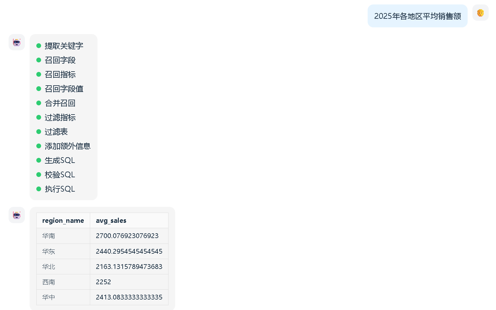
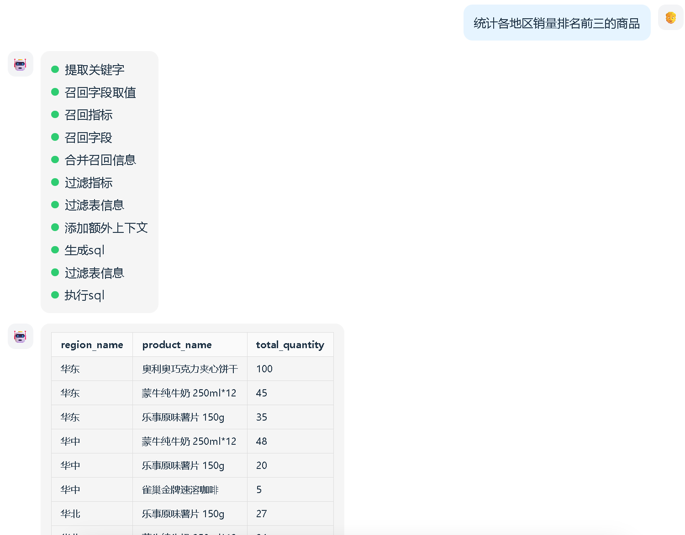

# 运行项目测试

## 1. 项目代码说明

- `docker`：后端支撑服务（mysql数据库、qdrant向量索引库和es全文索引库）
- `data-agent`：后端项目
- `data-agent_frontend`：前端项目

## 2. 通过docker安装中间件启动服务

- 启动`windows版本docker`（docker desktop）
- 进入docker目录下执行命令: `docker compose up -d`

> 注意：
>
> 1. 第一次运行整个过程时间会比较长，耐心等待
>
> 2. 需要下载的embedding包可能需要科学上网才能成功
> 3. mysql服务可能无法启动，原因：windows中已经启动了mysql的服务，需要先停止已有的mysql服务

## 3. 构建知识库

- 进入后端项目目录data-agent，运行构建脚本`app/scripts/build_meta_knowledge.py`

## 4. 运行后端项目

- 进入后端项目目录data-agent，运行启动脚本`main.py`

## 5. 运行前端项目

- 进入前端项目目录data-agent_frontend，执行命令：`npm run dev`

## 6. 访问测试

- 浏览器上访问： http://127.0.0.1:5173/
- 搜索相关问题
  - 华北地区销售总额
  - 2025年各地区平均销售额
  - 各个地区iPhone去年卖了多少钱
  - 各地区销量排名前三的商品

## 7. 运行效果展示

### 7.1. 测试一：华北地区销售总额


生成的sql:

~~~sql
select sum(`dw2`.`fo`.`order_amount`) AS `GMV`
from `dw2`.`fact_order` `fo`
         join `dw2`.`dim_region` `dr`
where ((`dw2`.`fo`.`region_id` = `dw2`.`dr`.`region_id`) and (`dw2`.`dr`.`region_name` = '华北'))
~~~

### 7.2. 测试二：2025年各地区平均销售额



生成的sql:

~~~sql
SELECT d.region_name, AVG(f.order_amount) AS avg_sales
FROM fact_order f
JOIN dim_region d ON f.region_id = d.region_id
JOIN dim_date dt ON f.date_id = dt.date_id
WHERE dt.year = 2025
GROUP BY d.region_name;
~~~

### 7.3. 测试三：各个地区iPhone去年卖了多少钱？


生成的sql语句：

~~~sql
SELECT
    r.region_name AS 地区,
    SUM(f.order_amount) AS 销售额
FROM fact_order f
JOIN dim_region r ON f.region_id = r.region_id
JOIN dim_product p ON f.product_id = p.product_id
JOIN dim_date d ON f.date_id = d.date_id
WHERE p.product_name LIKE '%iPhone%'
  AND d.date_id BETWEEN 20250101 AND 20251231
GROUP BY r.region_name;
~~~

### 7.4. 测试四：各地区销量排名前三的商品




生成的sql语句：

```sql
SELECT t.region_name, t.product_name, t.total_quantity, t.ranking
FROM (
    SELECT
        r.region_name,
        p.product_name,
        SUM(f.order_quantity) AS total_quantity,
        RANK() OVER (PARTITION BY r.region_name ORDER BY SUM(f.order_quantity) DESC) AS ranking
    FROM fact_order f
    JOIN dim_region r ON f.region_id = r.region_id
    JOIN dim_product p ON f.product_id = p.product_id
    GROUP BY r.region_name, p.product_name
) t
WHERE t.ranking <= 3
ORDER BY t.region_name, t.ranking;
```
