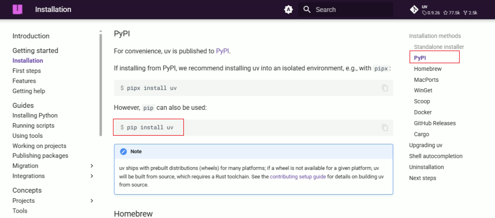
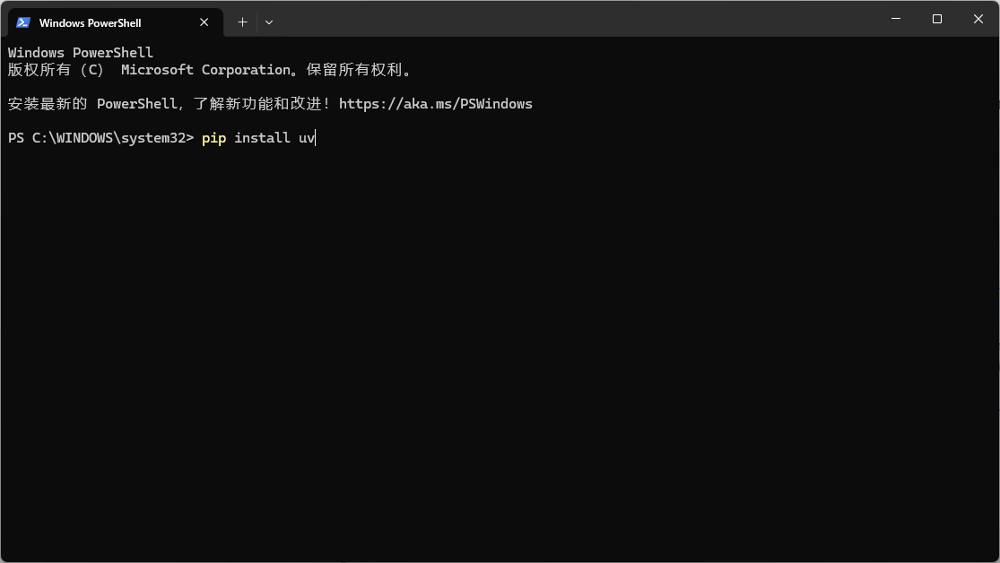
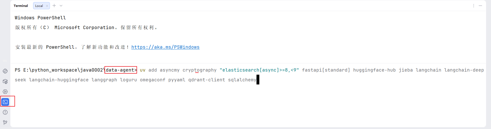
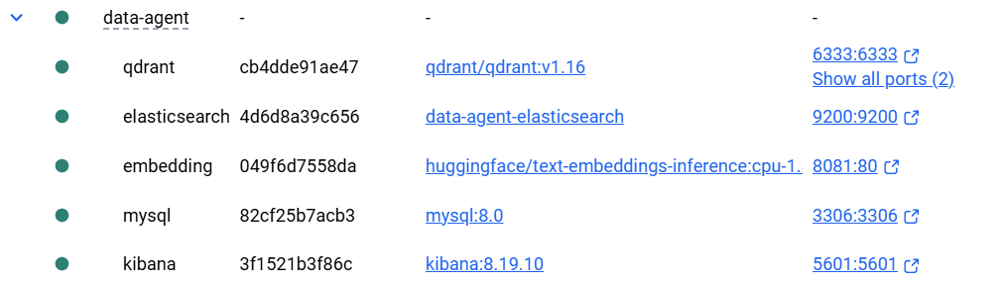

# 项目开发环境

## 1. 创建项目

本项目使用 [`uv`](https://docs.astral.sh/uv/getting-started/installation/)进行依赖管理与虚拟环境管理

> 1. 创建项目文件夹：data-agent_xxx
> 2. 使用uv初始化项目：uv init
> 3. 创建uv虚拟虚拟环境：uv venv
> 4. 使用pycharm打开项目

创建项目后目录结构：

~~~
data-agent/
├── .git/               # git本地仓库目录
├── .venv/              # UV 创建的虚拟环境目录
├── .gitignore          # git忽略配置文件
├── main.py              # 项目入口脚本
├── pyproject.toml       # 项目配置与依赖声明文件
├── .python-version     # 当前环境的python版本
└── README.md           # git项目的说明文档文件
~~~

## 2. 安装项目依赖

UV（Unified Virtualenv ）是一款由 Astral 公司开发的**极速 Python 包管理与虚拟环境工具**它基于 Rust 语言开发，核心解决了传统 Python 包管理工具（如 pip）安装速度慢、依赖解析复杂、跨平台兼容性差等问题，同时整合了虚拟环境创建、包安装 / 卸载 / 更新、依赖锁定等全流程能力，是当前 Python 生态中最热门的新一代包管理工具,提供依赖管理、虚拟环境创建、Python 版本管理等一站式服务。



打开Windows PowerShell：



~~~shell
# 执行安装
PS C:\WINDOWS\system32> pip install uv
# 查看安装
PS C:\WINDOWS\system32> uv --version
uv 0.11.14

~~~

常用操作：

1.虚拟环境管理

| 操作                 | 命令示例                                                     | 说明                                                         |
| -------------------- | ------------------------------------------------------------ | ------------------------------------------------------------ |
| 创建虚拟环境         | `uv venv`                                                    | 在当前目录创建 `.venv` 虚拟环境（默认路径）；可指定路径：`uv venv ./myenv` |
| 指定 Python 版本创建 | `uv venv --python 3.12`                                      | 创建基于 Python 3.12 的虚拟环境（需系统已安装对应版本）      |
| 激活虚拟环境         | Windows：`.venv\Scripts\activate`  Linux/macOS：`source .venv/bin/activate` | 激活后终端前缀会显示 `(.venv)`，表示进入虚拟环境             |
| 删除虚拟环境         | `rm -rf .venv`（Linux/macOS） `rmdir /s .venv`（Windows）    | UV 无专门删除命令，直接删除环境目录即可                      |


2.依赖操作指令

| 指令场景                        | 指令示例                       | 说明                                                         |
| ------------------------------- | ------------------------------ | ------------------------------------------------------------ |
| 安装单个包                      | `uv add requests`              | 安装最新兼容版本，自动写入 `pyproject.toml` 的 `dependencies` |
| 安装指定版本                    | `uv add requests==2.31.0`      | 安装固定版本，避免自动升级                                   |
| 安装版本范围                    | `uv add "requests>=2.30,<3.0"` | 安装 2.30 及以上、3.0 以下版本（兼容写法）                   |
| 安装开发依赖                    | `uv add --dev pytest`          | 安装到 `[project.optional-dependencies].dev`，仅用于开发环境 |
| 批量安装（从 requirements.txt） | `uv add -r requirements.txt`   | 把 `requirements.txt` 中的依赖全部导入到 `pyproject.toml` 并安装 |
| 安装可选依赖组                  | `uv add fastapi[standard]`     | 安装包含可选依赖的包（如 fastapi 的 standard 扩展）          |
| 离线安装（仅用缓存）            | `uv add requests --offline`    | 不联网，仅从本地缓存安装（需提前下载过该包）                 |

默认缓存目录： C:\Users\用户名\AppData\Local\uv\cache


创建项目和创建环境

| 命令      | 核心作用                                                   | 适用场景                                                   |
| --------- | ---------------------------------------------------------- | ---------------------------------------------------------- |
| `uv init` | 初始化一个完整的 Python 项目                               | 新建一个基于uv的项目                                       |
| `uv venv` | 仅创建纯虚拟环境 (.env)                                    | 只想快速建一个空的虚拟环境，不需要项目配置（比如临时测试） |
| `uv sync` | 将项目的依赖同步到当前虚拟环境中，如果没有.env，先自动创建 | 根据依赖声明下载所有依赖                                   |


以下是项目所需的全部依赖



注意：在项目根目录执行一下依赖安装，必须是在初始化完成后，有pyproject.toml的情况。

```bash
uv add asyncmy cryptography "elasticsearch[async]>=8,<9" fastapi[standard] huggingface-hub jieba langchain langchain-deepseek langchain-huggingface langgraph loguru omegaconf qdrant-client sqlalchemy
```

版本变更后

~~~
uv add asyncmy==0.2.11 cryptography==46.0.4 "elasticsearch[async]>=8,<9" fastapi[standard]==0.128.0 huggingface-hub==0.36.0 jieba==0.42.1 langchain==1.2.7 langchain-deepseek==1.0.1 langchain-huggingface==1.2.1 langgraph==1.0.7 loguru==0.7.3 omegaconf==2.3.0 qdrant-client==1.16.2 sqlalchemy==2.0.46
~~~


依赖说明如下： 

- [fastapi](https://fastapi.org.cn/)：高性能异步 Web 框架，作为整个服务的 API 入口。

- [sqlalchemy](https://docs.sqlalchemy.org/en/20/orm/quickstart.html)：Python 最主流 ORM，用统一模型管理数据库读写与事务。

- [asyncmy](https://pypi.org/project/asyncmy/)：基于 asyncio 的异步 MySQL 驱动，配合 SQLAlchemy 实现全异步数据库访问。

- [qdrant-client](https://python-client.qdrant.tech/)：向量数据库客户端，用于 Embedding 向量存储与相似度检索。

- [elasticsearch](https://www.elastic.co/guide/en/elasticsearch/reference/8.19/elasticsearch-intro-what-is-es.html)[async]：异步 Elasticsearch 客户端，用于全文检索。

- [langchain](https://docs.langchain.com/oss/python/langchain/overview)：LLM 应用编排框架，用于构建 RAG、Tool 调用、Prompt 链路。

- [langchain-huggingface](https://docs.langchain.com/oss/python/integrations/text_embedding/huggingfacehub)：LangChain 与 HuggingFace 模型的桥接层（Embedding / LLM 加载）。

- [langgraph](https://docs.langchain.com/oss/python/langgraph/quickstart)：用图结构构建可控 Agent 流程。

- [jieba](https://github.com/fxsjy/jieba)：中文分词库。

- [omegaconf](https://omegaconf.readthedocs.io/en/2.3_branch/index.html)：加载yaml配置。

- [loguru](https://loguru.readthedocs.io/en/stable/)：更优雅的日志库，替代 logging，适合工程化项目。

  

## 3. 搭建开发环境

本项目采用 Docker 管理开发环境，相关容器配置文件已提供于课程资料中的 `docker` 目录。将该目录拷贝至项目根目录后，进入 `docker` 目录并执行 `docker compose up -d`，即可一键启动项目所需的全部基础服务。



docker使用两种方式：

方式一：选择VMware中的环境安装docker

方式二：在Windows中直接安装[Docker desktop](https://docs.docker.com/desktop/)

注意：可以Docker desktop需要依赖运行环境wsl2，在安装过程中选择安装即可（网络原因可能失败率较高）

wsl2：Windows Subsystem for Linux 2， 在 Windows 里直接跑一个轻量 Linux 系统。

compose常用操作指令

| 指令场景                | 指令示例                         | 说明                                                         |
| ----------------------- | -------------------------------- | ------------------------------------------------------------ |
| 启动 / 创建容器（前台） | `docker compose up`              | 读取配置文件，创建并启动所有服务（前台运行，终端关闭则容器停止） |
| 启动 / 创建容器（后台） | `docker compose up -d`           | 后台运行容器（生产 / 开发环境首选），返回容器 ID             |
| 启动指定服务            | `docker compose up -d web mysql` | 只启动 `web` 和 `mysql` 服务，忽略其他服务                   |
| 停止容器（保留容器）    | `docker compose stop`            | 停止所有运行的服务容器，容器、数据卷、网络均保留，可再次启动 |
| 重启容器                | `docker compose restart`         | 重启所有服务容器；加 `-t 10` 指定等待时间（如 `restart -t 10`） |
| 重启指定服务            | `docker compose restart mysql`   | 只重启 `mysql` 服务                                          |
| 停止并删除容器          | `docker compose down`            | 停止并删除所有容器，默认保留数据卷和网络                     |
| 彻底清理（含数据卷）    | `docker compose down -v`         | 停止并删除容器 + 数据卷 + 网络（谨慎使用，会丢失持久化数据） |
| 查看启动的服务          | `docker ps`                      | 查看当前项目下正在运行的docker服务                           |

简单理解：Compose 的所有操作，本质都是 “按配置文件的规则，批量管理一组容器的生命周期”。


## 4. 安装所需服务

### 4.1. 服务说明

本项目所需的全部服务如下：

- MySQL

MySQL 用于存储数据仓库的元数据信息，包括表格信息、字段信息和指标信息，同时也充当业务数据仓库使用（模拟 Hive 场景）。

- Qdrant

Qdrant 作为向量数据库，用于存储字段信息、指标信息的向量表示，在用户提问时通过语义相似度检索出最相关的元数据，为生成SQL提供高相关性的上下文信息。

- ElasticSearch

Elasticsearch 对各维度字段的实际取值建立倒排索引。当用户问题中包含自然语言形式的维度描述时（例如“华北地区”、“数码品类”），可通过全文检索匹配到数据库中真实存在的字段取值，为生成 SQL 时的 WHERE 条件或者GROUP BY分组提供准确依据。

- Kibana

Kibana 是 Elasticsearch 的可视化管理与调试界面，用于索引管理、查询语句调试以及检索效果验证，方便开发过程中观察和优化检索行为。

- Text Embedding Inference

简称：TEI,Text Embedding Inference 用于部署 Embedding 模型推理服务，将元数据文本及用户问题转换为向量表示，为 Qdrant 提供向量数据来源，是语义检索能力的基础。当前服务运行bge-large-zh-v1.5 中文文本嵌入模型。实现中文文本的嵌入。

> bge-large-zh-v1.5 (简称：BGE)是智源研究院（BAAI）推出的中文专用、大参数量、高精度文本嵌入模型，主打强中文语义理解、高维向量、长文本支持、检索友好，是当前中文 RAG / 语义检索场景的工业级首选模型。
>
> TEL和BGE的关系：`TEI 负责高效运行 BGE，BGE 提供高质量语义向量能力`。

### 4.2. 安装

​	本项目所需的全部基础服务通过 Docker Compose 统一部署。相关脚本与依赖文件已包含在项目资料中。进入 docker-compose.yaml 所在目录，执行以下命令即可完成所有服务的安装与启动：

```bash
docker compose up -d
```
