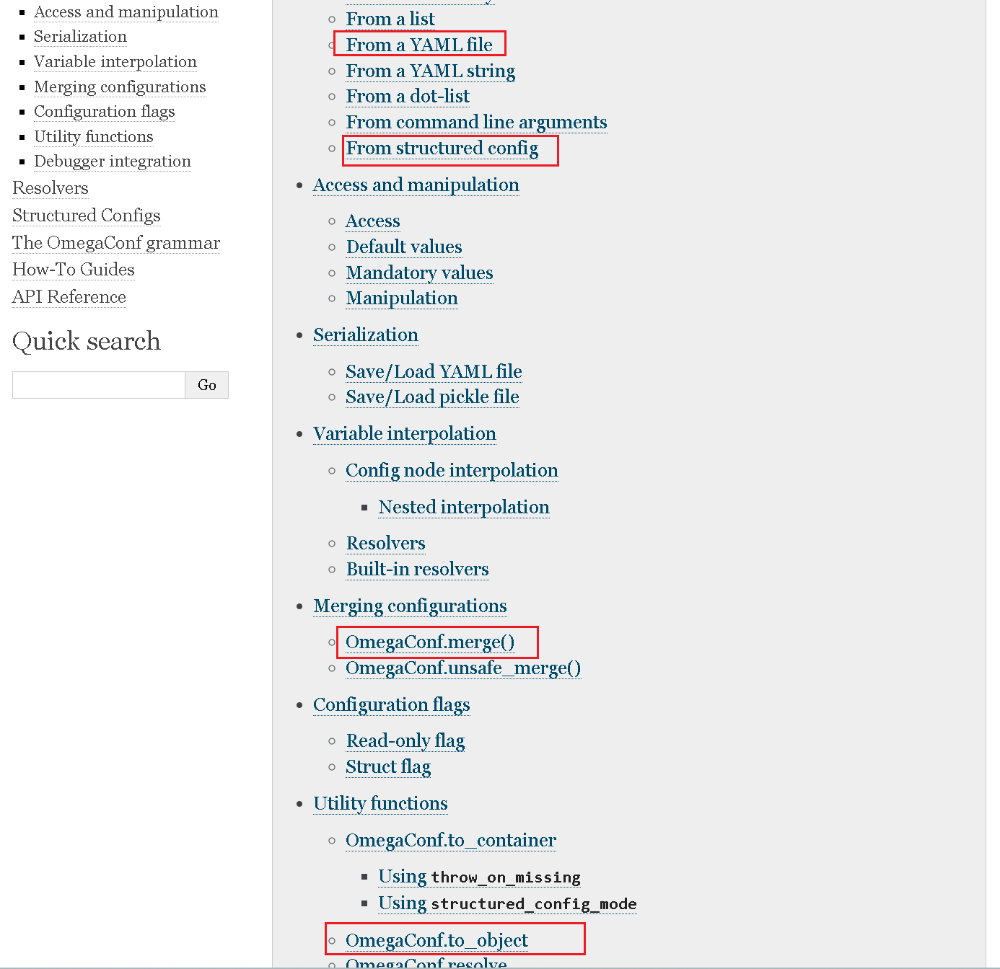
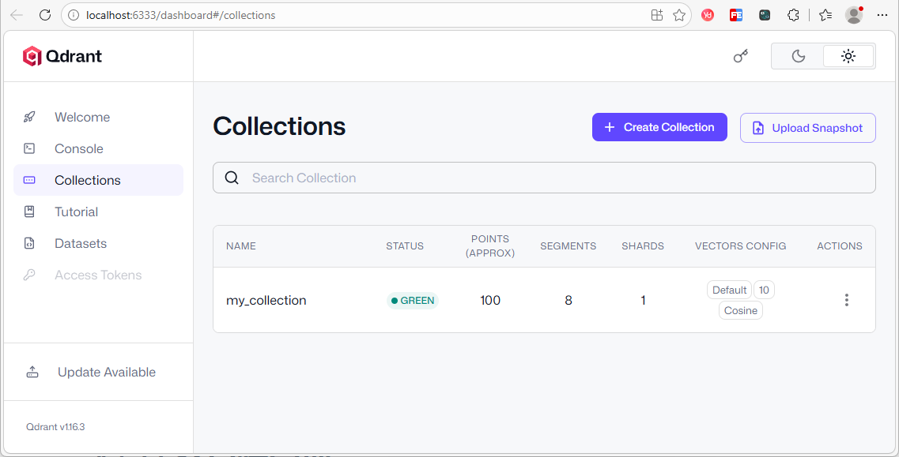

# 基础设施搭建

## 1. 项目目录结构

```yaml
data-agent #根目录
├── app #代码目录
│   ├── agent #智能体
│   ├── api #接口
│   ├── clients #数据库客户端
│   ├── conf #配置类
│   ├── core #基础设施
│   ├── models #数据库实体类
│   ├── prompt #提示词工具
│   ├── repositories #Repo层——负责数据库底层查询
│   ├── scripts #脚本
│   └── services #Service层——负责具体的业务逻辑
├── conf #配置文件
└── prompts #提示词目录
```

## 2. 项目配置管理

### 2.1. 配置文件

本项目采用 YAML 文件管理配置参数，配置文件的路径为 `data-agent/conf/app_config.yaml` 。以下是本项目所需的全部参数。

~~~yaml
# 1. 对象结构
JSON对象结构：
    {
      "name": "张三",
      "age": 18,
      "height": 1.8
    }
yaml对象结构：
    name: 张三
    age: 18
    height: 1.8

# 2. 数组/列表结构
json数组结构：
	["张三","李四","王五"]
yaml数组结构：
    - 张三
    - 李四
    - 王五

# 3. 对象数组结构	
json对象数组结构：
    [
      {
        "name": "张三",
        "age": 18,
        "gender": "男"
      },
      {
        "name": "李四",
        "age": 20,
        "gender": "男"
      }
    ]
yaml对象数组结构：
    - name:  "张三"
      age: 18
      gender: "男"
    - name:  "李四"
      age: 20
      gender: "男"

~~~

```yaml
# 日志配置
logging:
  file:
    enable: true
    level: INFO
    path: logs
    rotation: "10 MB"
    retention: "7 days"
  console:
    enable: true
    level: INFO

# 数据库meta的配置
db_meta:
  host: localhost
  port: 3306
  user: atguigu
  password: Atguigu.123
  database: meta

# 数据库dw的配置
db_dw:
  host: localhost
  port: 3306
  user: atguigu
  password: Atguigu.123
  database: dw

# qdrant的配置
qdrant:
  host: localhost
  port: 6333
  embedding_size: 1024

# embedding的配置
embedding:
  host: localhost
  port: 8081
  model: BAAI/bge-large-zh-v1.5

# es的配置
es:
  host: localhost
  port: 9200
  index_name: data_agent

# llm的配置
llm:
  model_name: deepseek-chat
  api_key: <deepseek_api_key>
```

### 2.2. 加载工具

**[OmegaConf](https://omegaconf.readthedocs.io/en/2.3_branch/index.html))** 是由 Facebook开源的Python 配置管理库，核心定位是为机器学习 / 深度学习项目（也适用于各类 Python 项目）提供灵活、强类型、易扩展的配置解决方案。它解决了传统配置文件（YAML/JSON）在动态配置、类型校验、参数合并等场景下的痛点

本项目使用的yaml配置文件加载工具为[OmegaConf](https://omegaconf.readthedocs.io/en/2.3_branch/index.html)，具体用法参考其官网即可。


入门案例：

步骤一：定义配置文件

创建配置文件/conf/test_config.yaml

~~~yaml
name: 张三
age: 18
height: 1.8
~~~

步骤二：读取配置文件

创建加载程序文件/app/conf/test_config.py

方式1：使用内置的yaml库

```python
import yaml
from pathlib import Path

# 得到yaml配置文件的绝对路径
yaml_file = Path(__file__).resolve().parents[0] / "conf" / "test_config.yaml"
# 打开yaml文件
with open(yaml_file, encoding="utf-8") as file:
    # 加载解析的yaml文件，得到对应的字典数据
    _yaml_data = yaml.safe_load(file)
    # 读取配置内容，并打印
    print(_yaml_data, type(_yaml_data))
	print(_yaml_data['name'])
```

> 问题：解析出的只能是字典，不能是约定好属性的对象，读取属性数据时不方便
>
> 解决：使用**OmegaConf**框架

方式二：使用OmegaConfig库

参考官网：[OmegaConf Usage](https://omegaconf.readthedocs.io/en/2.3_branch/usage.html)



~~~python
from pathlib import Path
from omegaconf import OmegaConf

# 定义配置路径
config_file = Path(__file__).parents[2] / 'config' / 'test_config.yaml'
# 读取配置数据
config_dict = OmegaConf.load(config_file)
# 读取配置内容，并打印
print(config_dict)
print(config_dict['name'])
~~~

优化读取，定义封装类型，读取配置文件内容封装到对应实体中

~~~python
from pathlib import Path
import yaml
from omegaconf import OmegaConf
from pydantic.dataclasses import dataclass

# 定义数据模型
@dataclass
class Person:
    name: str
    age: int
    height: float

# 得到yaml配置文件的绝对路径
yaml_path = Path(__file__).parents[2] / "conf/test_config.yaml"

# 根据路径加载配置文件数据 =》DictConfig对象
yaml_data = OmegaConf.load(yaml_path)

# 将数据转换为Person类型的对象
# OmegaConf.to_object(_yaml_data)   # 不可以，生成的是字典
person: Person = OmegaConf.to_object(OmegaConf.merge(Person, yaml_data))

# 输出
print(person, type(person))
print(person.name)
~~~

### 2.3. 加载配置文件

用于读取配置文件的代码放置在`data-agent/app/conf/app_config.py`文件中，具体内容如下：

```python
"""
解析conf/app_config.yaml文件, 生成指定类型的对象
"""
from pathlib import Path
from omegaconf import OmegaConf
from pydantic.dataclasses import dataclass

# ==================== 日志配置模型 ====================
@dataclass
class File:
    enable: bool
    level: str
    path: str
    rotation: str
    retention: str


@dataclass
class Console:
    enable: bool
    level: str

@dataclass
class LoggingConfig:
    file: File
    console: Console


# ==================== database配置模型 ====================

@dataclass
class DBConfig:
    host: str
    port: int
    user: str
    password: str
    database: str

# ==================== Qdrant 配置模型 ====================

@dataclass
class QdrantConfig:
    host: str
    port: int
    embedding_size: int


# ==================== Embedding 配置模型 ====================

@dataclass
class EmbeddingConfig:
    host: str
    port: int
    model: str


# ==================== ES 配置模型 ====================

@dataclass
class ESConfig:
    host: str
    port: int
    index_name: str


# ==================== LLM 配置模型 ====================

@dataclass
class LLMConfig:
    model_name: str
    api_key: str


# ==================== 应用总配置模型 ====================

@dataclass
class AppConfig:
    logging: LoggingConfig
    db_meta: DBConfig
    db_dw: DBConfig
    qdrant: QdrantConfig
    embedding: EmbeddingConfig
    es: ESConfig
    llm: LLMConfig

# 得到yaml配置文件的绝对路径
_yaml_path = Path(__file__).parents[2] / "conf" / "app_config.yaml"

# 根据路径加载配置文件数据 =》DictConfig对象
_yaml_data = OmegaConf.load(_yaml_path)

# 将数据转换为AppConfig类型的对象
app_config: AppConfig = OmegaConf.to_object(OmegaConf.merge(AppConfig, _yaml_data))


if __name__ == "__main__":
    print(app_config)
    print(app_config.logging.console.level)

```

## 3. MySQL库客户端管理

**[SQLAlchemy](https://www.sqlalchemy.org/)** 是 Python 生态中最主流的 ORM（Object Relational Mapper，对象关系映射）框架，也是 Python 官方推荐的数据库操作工具之一。它的核心定位是「数据库交互的抽象层」—— 让开发者用 Python 对象的方式操作数据库，无需直接编写原生 SQL，同时保留对原生 SQL 的灵活支持。

本项目中的MySQL客户端使用**SQLAlchemy**，具体用法参考官方文档。

### 3.1. 基本使用

在`data-agent/app/clients/mysql_client_manager.py`中编写如下代码，用来管理MySQL客户端。

相关文档：

- [创建异步引擎](https://docs.sqlalchemy.org/en/20/dialects/mysql.html#module-sqlalchemy.dialects.mysql.asyncmy)

- [异步会话](https://docs.sqlalchemy.org/en/20/orm/extensions/asyncio.html#sqlalchemy.ext.asyncio.AsyncSession)

基础实现：

```python
"""
操作mysql数据库数据的客户端管理器模块
"""
import asyncio
from typing import Optional

from sqlalchemy import text
from sqlalchemy.ext.asyncio import AsyncEngine, create_async_engine, AsyncSession

from app.conf.app_config import app_config
from app.conf.app_config import DBConfig

class MysqlClientManager:
    def __init__(self, config: DBConfig):
        self.config = config
        self.client: Optional[AsyncEngine] = None   # AsyncEngine|None
    # 获取连接字符串
    def _get_url(self):
        return f"mysql+asyncmy://{self.config.user}:{self.config.password}@{self.config.host}/{self.config.database}?charset=utf8mb4"
    # 初始化
    def init(self):
        # 创建一个异步引擎
        self.client = create_async_engine(
            self._get_url()
        )
    # 释放资源
    async def close(self):
        await self.client.dispose()

# 创建操作dw库的客户端管理器
dwMysqlClientManager = MysqlClientManager(app_config.db_dw)
# 创建操作meta库的客户端管理器
metaMysqlClientManager = MysqlClientManager(app_config.db_meta)

if __name__  == "__main__":
    async def test():
        # 初始化dw客户端对象
        dwMysqlClientManager.init()

        # 创建异步会话
        async with AsyncSession(dwMysqlClientManager.engin) as session:
            # 执行查询sql
            sql = "select * from dim_customer limit 2"
            result = await session.execute(text(sql))

            # 读取数据
            """
            result.all()    返回 [row, row, row]  row是可迭代的对象
            result.mappings().all() 返回 [rowMapping, rowMapping, rowMapping]  rowMapping是包含一行数据的字段名和字段值的对象
            result.scalars().all() 所回 [val, val, val]  val是第一列值
            """

            # rows = result.all()  # 返回 [row, row, row]   row是可迭代的对象
            # for row in rows:
            #     for val in row:
            #         print(val)

            # rows = result.mappings().all() # 返回 [rowMapping, rowMapping, rowMapping]  rowMapping是包含一行数据的字段名和字段值的对象
            # for row in rows:
            #     for key, val in row.items():
            #         print(key, val)

            rows = result.scalars().all()  # 所回 [val, val, val]  val是第一列值
            for row in rows:
                print(row)

        # 释放资源
        await dwMysqlClientManager.close()

    asyncio.run(test())
```

### 3.2. 优化配置编码

在创建引擎和创建会话时可以进行一些订制化的配置

参数说明1：[引擎创建参数](https://docs.sqlalchemy.org/en/20/core/engines.html#sqlalchemy.create_engine)

~~~python
pool_size=10：
	pool_size 用来指定内部维护的“常驻”连接的个数，默认是5。
    当需要连接时，默认就会取空闲的常驻连接使用。使用完了归还。
    
max_overflow=5
	当所有常驻连接都已经被使用时，会创建“临时”连接，使用完了关闭
    但当创建的临时连接数达到了max_overflow（默认是10）时，只能等待（直到有人归还或超时报错）
	
~~~

参数说明2: [Session创建的参数](https://docs.sqlalchemy.org/en/20/orm/session_api.html#sqlalchemy.orm.Session)

~~~python
1.autoflush：自动刷新
	默认值为 True
	控制执行查询前，是否自动将当前会话中未提交的修改到数据库的暂存区（未真正提交事务）
    查询时能查询到修改后的最新数据
    修改的数据只有在提交事务后才真正同步到数据库中

2.autobegin: 自动开启事务
    默认值为 True
	控制 Session 是否自动为首次数据库操作开启事务，无需开发者手动调用 session.begin()。

~~~


优化的关键代码


```python
self.client = create_async_engine(
    self._get_url(),
    pool_size=10, # 内部连接池中缓存的长久连接数   默认是5
    max_overflow=5, # 最大临时连接数， 默认是10
)


async with AsyncSession(
    dwMysqlClientManager.engin,
    autoflush = False, # 查询看不到前面未提交的修改
    autobegin = True, # 自动开启事务
) as session:
```


### 3.3. 优化session对象的创建

优化：使用[AsyncSessionmaker](https://docs.sqlalchemy.org/en/20/orm/extensions/asyncio.html#sqlalchemy.ext.asyncio.async_sessionmaker)来优化AsyncSession对象的创建

~~~python
async_sessionmaker作用：
	async_sessionmaker 本质是一个异步会话工厂类，它接收一组会话配置
    调用它，返回一个“可执行”的工厂对象函数(内部有__call__方法)；
    执行这个工厂对象函数就能创建出配置完全一致的 AsyncSession实例。

self.session_factory = async_sessionmaker(
    bind=self.client, # 绑定异步引擎
    autoflush = False, # 查询看不到前面未提交的修改
    autobegin = True, # 自动开启事务
)
~~~

优化后的代码

~~~python
"""
操作mysql数据库数据的客户端管理器模块
"""
import asyncio
from typing import Optional, Generic

from sqlalchemy import text
from sqlalchemy.ext.asyncio import AsyncEngine, create_async_engine, AsyncSession, async_sessionmaker

from app.conf.app_config import app_config
from app.conf.app_config import DBConfig

class MysqlClientManager:
    def __init__(self, config: DBConfig):
        self.config = config
        self.client: Optional[AsyncEngine] = None
        self.session_factory: Optional[async_sessionmaker] = None

    # 获取连接字符串
    def _get_url(self):
        return f"mysql+asyncmy://{self.config.user}:{self.config.password}@{self.config.host}/{self.config.database}?charset=utf8mb4"
    # 初始化
    def init(self):
        # 创建一个异步引擎
        self.client = create_async_engine(
            self._get_url(),
            pool_size=10, # 内部连接池中缓存的长久连接数   默认是5
            max_overflow=5, # 最大临时连接数， 默认是10
        )
        # 创建一个异步会话工厂
        self.session_factory = async_sessionmaker(
            self.client,
            autoflush=False,  # 查询看不到前面未提交的修改
            autobegin=True,  # 自动开启事务
        )

    # 释放资源
    async def close(self):
        await self.client.dispose()

# 创建操作dw库的客户端管理器
dwMysqlClientManager = MysqlClientManager(app_config.db_dw)
# 创建操作meta库的客户端管理器
metaMysqlClientManager = MysqlClientManager(app_config.db_meta)

if __name__  == "__main__":

    async def test():
        # 初始化dw客户端对象
        dwMysqlClientManager.init()

        # if dwMysqlClientManager.session_factory is None:
        #     raise RuntimeError("session_factory not initialized")

        # 创建异步会话
        async with dwMysqlClientManager.session_factory() as session:
            session: AsyncSession # 声明类型方便后续使用

            # 执行查询sql
            sql = "select * from dim_customer limit 2"
            result = await session.execute(text(sql))

            # 读取数据
            """
            result.all()    返回 [row, row, row]  row是可迭代的对象
            result.mappings().all() 返回 [rowMapping, rowMapping, rowMapping]  rowMapping是包含一行数据的字段名和字段值的对象
            result.scalars().all() 所回 [val, val, val]  val是第一列值
            """

            # rows = result.all()  # 返回 [row, row, row]   row是可迭代的对象
            # for row in rows:
            #     for val in row:
            #         print(val)

            # rows = result.mappings().all() # 返回 [rowMapping, rowMapping, rowMapping]  rowMapping是包含一行数据的字段名和字段值的对象
            # for row in rows:
            #     for key, val in row.items():
            #         print(key, val)

            rows = result.scalars().all()  # 所回 [val, val, val]  val是第一列值
            for row in rows:
                print(row)

        # 释放资源
        await dwMysqlClientManager.close()

    asyncio.run(test())
~~~


### 3.4. ORM操作

​		SqlAichemy库最大的特点是我们不用写sql语句，进行表数据的CURD操作。

1. 定义表对应的实体类

SqlAichemy的[实体类](https://docs.sqlalchemy.org/en/20/orm/quickstart.html)创建：

**DeclarativeBase**是SQLAlchemy 2.0 官方推荐的唯一基类,是实现 SQLAlchemy ORM 的「基类」，所有数据库模型都必须继承它,

- ​	 统一管理所有表结构

- ​	 统一连接、元数据管理

- ​	 提供 ORM 映射能力

- ​	 SQLAlchemy 2.0 标准写法


- `data-agent/app/models/mysql/base.py`

  ```python
  from sqlalchemy.orm import DeclarativeBase
  
  class Base(DeclarativeBase):
      pass
  
  ```

- `data-agent/app/models/mysql/table_info_mysql.py`

  ```python
  from sqlalchemy import String, Text
  from sqlalchemy.orm import Mapped, mapped_column
  
  from app.models.mysql.base import Base
  
  class TableInfoMySQL(Base):
      __tablename__ = "table_info"
  
      id: Mapped[str] = mapped_column(
          String(64),
          primary_key=True,
          comment="表编号"
      )
      name: Mapped[str] = mapped_column(
          String(128),
          comment="表名称"
      )
      role: Mapped[str] = mapped_column(
          String(32),
          comment="表类型(fact/dim)"
      )
      description: Mapped[str] = mapped_column(
          Text,
          comment="表描述"
      )
  
  ```

- `data-agent/app/models/mysql/column_info_mysql.py`

  ```python
  from sqlalchemy import String, Text
  from sqlalchemy.types import JSON
  from sqlalchemy.orm import Mapped, mapped_column
  
  from app.models.mysql.base import Base
  
  
  class ColumnInfoMySQL(Base):
      __tablename__ = "column_info"
  
      id: Mapped[str] = mapped_column(
          String(64),
          primary_key=True,
          comment="列编号"
      )
      name: Mapped[str] = mapped_column(
          String(128),
          comment="列名称"
      )
      type: Mapped[str] = mapped_column(
          String(64),
          comment="数据类型"
      )
      role: Mapped[str] = mapped_column(
          String(32),
          comment="列类型(primary_key,foreign_key,measure,dimension)"
      )
      examples: Mapped[list] = mapped_column(
          JSON,
          comment="数据示例"
      )
      description: Mapped[str] = mapped_column(
          Text,
          comment="列描述"
      )
      alias: Mapped[list] = mapped_column(
          JSON,
          comment="列别名"
      )
      table_id: Mapped[str] = mapped_column(
          String(64),
          comment="所属表编号"
      )
  
  ```

- `data-agent/app/models/mysql/metric_info_mysql.py`

  ```python
  from sqlalchemy import String, Text
  from sqlalchemy.types import JSON
  from sqlalchemy.orm import Mapped, mapped_column
  
  from app.models.mysql.base import Base
  
  
  class MetricInfoMySQL(Base):
      __tablename__ = "metric_info"
  
      id: Mapped[str] = mapped_column(
          String(64),
          primary_key=True,
          comment="指标编码"
      )
      name: Mapped[str | None] = mapped_column(
          String(128),
          comment="指标名称"
      )
      description: Mapped[str | None] = mapped_column(
          Text,
          comment="指标描述"
      )
      relevant_columns: Mapped[dict | list | None] = mapped_column(
          JSON,
          comment="关联字段"
      )
      alias: Mapped[dict | list | None] = mapped_column(
          JSON,
          comment="指标别名"
      )
  
  ```

- `data-agent/app/models/column_metric_mysql.py`

  ```python
  from sqlalchemy import String
  from sqlalchemy.orm import Mapped, mapped_column
  
  from app.models.mysql.base import Base
  
  
  class ColumnMetricMySQL(Base):
      __tablename__ = "column_metric"
  
      column_id: Mapped[str] = mapped_column(
          String(64),
          primary_key=True,
          comment="列编号"
      )
      metric_id: Mapped[str] = mapped_column(
          String(64),
          primary_key=True,
          comment="指标编号"
      )
  ```

- 基于模型类，就可以方便的进行数据库的CRUD操作

  ```python
  """
  操作mysql数据库数据的客户端管理器模块
  """
  import asyncio
  from typing import Optional
  from sqlalchemy import text, Select
  from sqlalchemy.ext.asyncio import AsyncEngine, create_async_engine, AsyncSession, async_sessionmaker
  from app.conf.app_config import app_config
  from app.conf.app_config import DBConfig
  from app.models.mysql.table_info_mysql import TableInfoMySQL
  
  
  class MysqlClientManager:
      def __init__(self, config: DBConfig):
          self.config = config
          self.client: Optional[AsyncEngine] = None
          self.session_factory: Optional[async_sessionmaker] = None
  
      # 获取连接字符串
      def _get_url(self):
          return f"mysql+asyncmy://{self.config.user}:{self.config.password}@{self.config.host}/{self.config.database}?charset=utf8mb4"
      # 初始化
      def init(self):
          # 创建一个异步引擎
          self.client = create_async_engine(
              self._get_url(),
              pool_size=10, # 内部连接池中缓存的长久连接数   默认是5
              max_overflow=5, # 最大临时连接数， 默认是10
          )
          self.session_factory = async_sessionmaker(
              self.client,
              autoflush=False,  # 查询看不到前面未提交的修改
              autobegin=True,  # 自动开启事务
          )
      # 释放资源
      async def close(self):
          await self.client.dispose()
  
  # 创建操作dw库的客户端管理器
  dwMysqlClientManager = MysqlClientManager(app_config.db_dw)
  # 创建操作meta库的客户端管理器
  metaMysqlClientManager = MysqlClientManager(app_config.db_meta)
  
  if __name__  == "__main__":
      
      # 测试ORM的更新和删除
      async def test_orm2():
          # 初始化meta客户端对象
          metaMysqlClientManager.init()
  
          # 创建异步会话
          async with metaMysqlClientManager.session_factory() as session:
              session: AsyncSession
  
              # 查询一条数据
              table_info = await session.get(TableInfoMySQL, "dim_customer1")
              print(table_info.description)
  
              # 添加一条数据
              # table_info.description = "xxxx"
  
              # 删除一条数据
              await session.delete(table_info)
  
              # 提交事务
              await session.commit()
  
          # 释放资源
          await metaMysqlClientManager.close()
  
      # 测试orm的添加和查询
      async def test_orm():
          # 初始化meta客户端对象
          metaMysqlClientManager.init()
  
          # 创建异步会话
          async with metaMysqlClientManager.session_factory() as session:
              session: AsyncSession
              # 添加一条数据
              info1 = TableInfoMySQL(
                  id="dim_customer1",
                  name="dim_customer1",
                  role="dim",
                  description="客户信息维度表1"
              )
              session.add(info1)
              # 再添加一条数据
              info2 = TableInfoMySQL(
                  id="dim_customer2",
                  name="dim_customer2",
                  role="dim",
                  description="客户信息维度表2"
              )
              session.add(info2)
  
              # 提交事务
              await session.commit()
  
              # 查询一条数据
              table_info = await session.get(TableInfoMySQL, "dim_customer1")
              print(table_info.description)
  
              # 查询多条数据
              # result = await session.execute(Select(TableInfoMySQL).limit(2))
              result = await session.execute(Select(TableInfoMySQL).from_statement(text("select * from table_info limit 2")))
              rows: list[TableInfoMySQL] = result.scalars().all()
              print(rows)
              print(rows[0].description)
  
              # 看是否可以在提交事务后读取ORM对象的属性
              # print(info1.name)
  
          # 释放资源
          await metaMysqlClientManager.close()
  
      asyncio.run(test_orm())
  ```
  


## 4. Qdrant客户端管理

Qdrant 是一款**开源、高性能、云原生的向量数据库**，专门用于**高维向量存储 + 相似度检索**，是现在 AI 应用（RAG、推荐、搜索）的标配存储组件。

Qdrant 的作用（核心用途）

1. 存储向量

   保存大模型 /embedding 模型生成的高维向量。

2. 快速相似度检索

   给定一个向量，快速找出最相似的 Top-K 向量。

3. 支持过滤检索

   向量检索 + 元数据（Payload）条件过滤同时使用。

4. 支撑 AI 应用

   - RAG 知识库检索
   - 语义搜索、智能问答
   - 图片 / 音视频多模态检索
   - 推荐系统、用户匹配、去重

本项目中的Qdrant客户端使用[qdrant-client](https://python-client.qdrant.tech/)，具体用法参考官方文档。

在`data-agent/app/clients/qdrant_client_manager.py`中编写如下代码，用来管理Qdrant客户端。 

可能参考：[异步Qdrant客户端使用文档](https://qdrant.tech/documentation/tutorials-develop/async-api/)

```python
import asyncio
import random
from typing import Optional
from qdrant_client import AsyncQdrantClient, models

from app.conf.app_config import QdrantConfig, app_config


class QdrantClientManager:
    """
    Qdrant向量数据库异步客户端管理器：封装客户端的初始化、关闭逻辑
    """

    def __init__(self, config: QdrantConfig):
        self.config = config
        self.client: Optional[AsyncQdrantClient] = None

    def _get_url(self):
        return f"http://{self.config.host}:{self.config.port}"

    def init(self):
        self.client = AsyncQdrantClient(self._get_url())

    async def close(self):
        await self.client.close()

# 创建向量数据库客户端管理器
qdrant_client_manager = QdrantClientManager(app_config.qdrant)

if __name__ == "__main__":
    async def test():
        collection_name = "test_collection"
        # 初始化客户端对象
        qdrant_client_manager.init()
        client = qdrant_client_manager.client

        # 创建集合, 如果集合已存在，先删除集合再创建
        if await client.collection_exists(collection_name):
            await client.delete_collection(collection_name)
        await client.create_collection(
            collection_name=collection_name,
            vectors_config=models.VectorParams(size=10, distance=models.Distance.COSINE),
        )

        # 插入向量
        await client.upsert(
            collection_name=collection_name,
            points=[
                models.PointStruct(
                    id=i,  # 标识id
                    payload={
                        "color": "red" if i % 2 == 0 else "blue",
                    },
                    # 生成10维随机向量
                    vector=[random.random() for _ in range(10)],
                )
                for i in range(100)  # 创建100个向量
            ],
        )

        # 搜索向量： 查找最相似的10个向量
        result = await client.query_points(
            collection_name=collection_name,
            query=[random.random() for _ in range(10)],  # 生成一个10维随机向量 用于查询
            limit=9, # 返回的最相似的9个向量
            # query_filter=models.Filter(
            #     must=[models.FieldCondition(key="color", match=models.MatchValue(value="red"))]
            # ),
            score_threshold= 0.9 # 向量相似度阈值，低于该阈值的向量将被忽略
        )

        print(result.points)
        print(len(result.points))
        
        for point in result.points:
            print(f"reload={point.payload}")

        # 释放资源
        await qdrant_client_manager.close()


    asyncio.run(test())

```


`参数说明`:

~~~
# 设置向量数据库向量存储规则
vectors_config=models.VectorParams(size=10, distance=models.Distance.COSINE),
参数一：size=10 表示存储10个维度向量
    简单理解就是：你要存的每个向量是 10 个数字组成的数组
    一般跟着模型设置值，BGE-large → 1024 维，属于高维度模型
 
参数二：distance=models.Distance.COSINE 用余弦相似度做距离计算方式
	特点“它不看向量长度，只看方向，方向越接近，两个向量就越相似
	最适合文本、图像、语义、特征、推荐、RAG。

~~~


客户端地址：[UI | Qdrant](http://localhost:6333/dashboard#/collections)



## 5. Embedding客户端管理

Hugging Face 文本嵌入推理（Text Embeddings Inference，简称 TEI）是一套用于部署和提供开源文本嵌入与序列分类模型服务的工具包。TEI 可为当下最主流的各类模型实现高性能的特征提取。bedding Inference客户端使用HuggingFaceEndpointEmbeddings，具体用法参考[官方文档](https://docs.langchain.com/oss/python/integrations/text_embedding/text_embeddings_inference)。向量模型服务创建时使用的是bge-large-zh-v1.5模型

在`data-agent/app/clients/embedding_client_manager.py`中编写如下代码，用来管理Text Embedding Inference客户端。

TEI和bge的关系：

BGE 是嵌入向量模型，TEI 是跑模型的服务化引擎；你通过 TEI 调用 BGE 做向量化

```python
from typing import Optional
from langchain_huggingface import HuggingFaceEndpointEmbeddings
from app.conf.app_config import EmbeddingConfig, app_config


class EmbeddingClientManager:
    """
    嵌入式向量嵌入客户端管理器类
    用于管理 HuggingFaceEndpointEmbeddings 客户端的初始化和配置
    """

    def __init__(self, config: EmbeddingConfig):
        self.config = config
        self.client: Optional[HuggingFaceEndpointEmbeddings] = None

    def _get_url(self):
        return f"http://{self.config.host}:{self.config.port}"

    def init(self):
        """
       初始化 HuggingFaceEndpointEmbeddings 客户端
       将拼接好的服务 URL 作为模型地址传入客户端
       """
        self.client = HuggingFaceEndpointEmbeddings(model=self._get_url())

# 创建向量数据库客户端管理器
embedding_client_manager = EmbeddingClientManager(app_config.embedding)

if __name__ == '__main__':
    async def test():
        # 初始化客户端
        embedding_client_manager.init_client()

        # 对单个文本内容进行异步向量化
        result = await embedding_client_manager.client.aembed_query("hello")
        print(result)
        print(len(result))

        # 对多个文本内容进行异步批量向量化
        result2 = await embedding_client_manager.client.aembed_documents(["hello", "world"])
        print(result2)
        print(len(result2))

    asyncio.run(test())

```


## 6. ES客户端管理

Elasticsearch（简称 ES）是一个**开源、分布式、RESTful 风格的搜索引擎**，基于 Lucene 构建，主打**全文检索、结构化检索、日志分析、数据统计**。

本项目中的ES客户端使用[elasticsearch](https://www.elastic.co/docs/reference/elasticsearch/clients/python)，具体用法参考官方文档。

在`data-agent/app/clients/es_client_manager.py`中编写如下代码，用来管理ES客户端。

[参考文档编写](https://www.elastic.co/guide/en/elasticsearch/reference/8.19/getting-started.html#getting-started-explicit-mapping)

```python
import asyncio
from typing import Optional
from elasticsearch import AsyncElasticsearch
from app.conf.app_config import ESConfig, app_config


class ESClientManager:
    """
    ES异步客户端管理器：封装ES客户端的初始化、连接，关闭逻辑
    """

    def __init__(self, config: ESConfig):
        self.config = config
        self.client: Optional[AsyncElasticsearch] = None

    def _get_url(self):
        return f"http://{self.config.host}:{self.config.port}"

    def init(self):
        self.client = AsyncElasticsearch(
            hosts=[self._get_url()]
        )

    async def close(self):
        await self.client.close()

# 创建ES客户端管理器对象
es_client_manager = ESClientManager(app_config.es)

if __name__ == "__main__":
    async def test():
        es_client_manager.init()
        client = es_client_manager.client
        index_name = "my_index"
        # 创建索引
        if await client.indices.exists(index=index_name):
            await client.indices.delete(index=index_name)
        result = await client.indices.create(
            index=index_name,
            mappings={
                "dynamic": False,
                "properties": {
                    "name": {
                        "type": "text"
                    },
                    "author": {
                        "type": "text"
                    },
                    "release_date": {
                        "type": "date",
                        "format": "yyyy-MM-dd"
                    },
                    "page_count": {
                        "type": "integer"
                    }
                }
            },
        )
        # print(result)


        # 插入数据
        result = await client.bulk(
            operations=[
                {
                    "index": {
                        "_index": index_name
                    }
                },
                {
                    "name": "Revelation Space",
                    "author": "Alastair Reynolds",
                    "release_date": "2000-03-15",
                    "page_count": 585
                },
                {
                    "index": {
                        "_index": index_name
                    }
                },
                {
                    "name": "1984",
                    "author": "George Orwell",
                    "release_date": "1985-06-01",
                    "page_count": 328
                },
                {
                    "index": {
                        "_index": index_name
                    }
                },
                {
                    "name": "Fahrenheit 451",
                    "author": "Ray Bradbury",
                    "release_date": "1953-10-15",
                    "page_count": 227
                },
                {
                    "index": {
                        "_index": index_name
                    }
                },
                {
                    "name": "Brave New World",
                    "author": "Aldous Huxley",
                    "release_date": "1932-06-01",
                    "page_count": 268
                },
                {
                    "index": {
                        "_index": index_name
                    }
                },
                {
                    "name": "The Handmaids Tale",
                    "author": "Margaret Atwood",
                    "release_date": "1985-06-01",
                    "page_count": 311
                }
            ],
        )
        print(result)
        
        # 刷新保存索引数据
        await client.indices.refresh(index=index_name)

        # 全文搜索
        result = await client.search(
            index=index_name,
            query={ # 搜索条件
                "match": { # 匹配字段
                    "name": "Brave"
                }
            },
        )
        print(result)
        print(result["hits"]["hits"])

        # 关闭ES客户端
        await es_client_manager.close()

    asyncio.run(test())

```

> 问题：
> 	搜索不到前面bulk插入的数据？
>    
>    原因：
>    	查不到文档的原因只有一个：ES 默认不会在写入后立即可见
> 	ES 默认每秒刷新一次索引，新写入的文档在内存 buffer 里，在下一次 refresh 之前对搜索不可见	
>    
>    ​	如果bulk后立即search，查不到刚插入的数据
> 
>    解决：
>    	bulk后立即手动刷新：client.indices.refresh()

## 7. 日志管理

### 7.1. ContextVar的理解和使用

- 需求：

  - 在做日志输出时需要记录当前请求id
  - 注意：不同请求在不同的协程中执行

- 基本思路：

  - 当接收到请求时，生成一个请求id（如：uuid）,并将其保存起来
  - 当前请求的后续所有处理函数中，读取保存的请求id，并在日志输出中显示

- 问题：如何实现请求id协程隔离级别的存取处理？

- 解决：使用ContextVar    => 协程安全的上下文变量

- 理解ContextVar:

  - 理解context对象：

    - 每个协程都有自己的上下文对象，互不干扰，可以向其中独立设置和获取不同变量名的数据

      => 协程1：context对象：{"aa": 数据1， "bb": 数据2}

      => 协程2：context对象：{"aa": 数据3， "bb": 数据4}

  - 理解ContextVar对象：

    -  我们可以通过ContextVar对象向当前协程的context对象中设置数据、获取数据和重置数据
    - context_var = ContextVar("aa", default="") => 协程1和协程2的context对象：{"aa": ""}
              => 协程1：context_var.set("1111")  => 协程1的context对象：{"aa": "1111"}
              => 协程2：context_var.set("2222")  => 协程2的context对象：{"aa": "2222"}
              => 协程1：context_var.get()  => "1111"
              => 协程2：context_var.get()  => "2222"
              => 协程1：context_var.reset() => 协程1的context对象: {}

- 注意：

  - ContextVar对象本身并不存储数据，数据存储在协程的context对象中
  - ContextVar对象是多个context对象的共享代理对象

在`data-agent/app/core/context.py`中编码如下，使用ContextVar来封装req_id的管理

```python

"""
ContextVar: 协程安全的上下文变量
    每个协程都有自己的上下文对象，互不干扰，可以向其中独立设置和获取不同变量名的数据
        =》协程1：context对象：{"aa": 数据1， "bb": 数据2}
        =》协程2：context对象：{"aa": 数据3， "bb": 数据4}
    我们可以通过ContextVar向当前协程的context对象中设置数据和获取数据
        context_var = ContextVar("aa", default="") => 协程1和协程2的context对象：{"aa": ""}
        => 协程1：context_var.set("1111")  => 协程1的context对象：{"aa": "1111"}
        => 协程2：context_var.set("2222")  => 协程2的context对象：{"aa": "2222"}
        => 协程1：context_var.get()  => "1111"
        => 协程2：context_var.get()  => "2222"
        => 协程1：context_var.reset() => 协程1的context对象: {}
    注意：ContextVar对象本身并不存储数据，数据存储在协程的context对象中 =》contextVar是context对象的代理对象
"""
import asyncio
from _contextvars import ContextVar, Token

# 创建用来管理请求id的上下文变量
_req_context_var = ContextVar("req_id", default="")

# 保存请求id
def set_req_id(request_id: str)->Token:
    return _req_context_var.set(request_id)

# 获取请求id
def get_req_id()->str:
    return _req_context_var.get()

# 重置请求id
def reset_req_id(token: Token):
    _req_context_var.reset(token)

if __name__ == '__main__':
    async def req1():
        print(f"before req1 req_id= {get_req_id()}")
        token = set_req_id("1111")
        await asyncio.sleep(1) # 模拟处理一定的时间
        print(f"after req1 req_id= {get_req_id()}")
        reset_req_id(token)
        print(f"after reset req1 req_id= {get_req_id()}")

    async def req2():
        print(f"before req2 req_id= {get_req_id()}")
        token = set_req_id("2222")
        await asyncio.sleep(1)  # 模拟处理一定的时间
        print(f"after req2 req_id= {get_req_id()}")
        reset_req_id(token)
        print(f"after reset req2 req_id= {get_req_id()}")

    async def test():
        await asyncio.gather(req1(), req2())

    asyncio.run(test())
```


### 7.2. 日志模块封装

```
# 定制日志输出格式，控制输出级别
# 自动将日志内容保存到日志文件
# 指定日志文件的最大大小，一旦超过自动创建一个新的的文件
# 指定文件的有效期，过了自动删除
# 记录当前日志输出是哪个请求的，记录请求id
```


Loguru 是一个致力于为 Python 带来「愉悦式日志体验」的库。

你是否也曾懒得配置日志器（logger），转而用 print () 来代替？…… 我反正这么做过。但日志功能对于任何应用程序而言都是不可或缺的核心环节，它能极大简化调试过程。使用 Loguru，你再也没有理由从项目一开始就不用日志功能 —— 只需简单写下 `from loguru import logger` 即可上手。

此外，该库还旨在通过新增一系列实用功能来解决标准日志器的痛点，让 Python 日志使用体验不再「痛苦」。在应用程序中使用日志本应是一种自然而然的习惯，而 Loguru 正试图让这件事既顺手又强大。

本项目使用[loguru](https://loguru.readthedocs.io/en/stable/#readme)管理日志，具体用法参考官网。


在`data-agent/app/core/log.py`中编写如下代码，统一管理日志。

```python
import asyncio
import sys
from pathlib import Path
from loguru import logger
from app.conf.app_config import app_config
from app.core.context import get_req_id, set_req_id

# 配置日志格式
log_format = (
    "<green>{time:YYYY-MM-DD HH:mm:ss.SSS}</green> | "  # 绿色显示日志时间（精确到毫秒）
    "<level>{level: <8}</level> | "  # 按级别颜色显示日志级别（左对齐，占8个字符）
    "<magenta>request_id - {extra[request_id]}</magenta> | "  # 品红色显示request_id（从日志extra中获取）
    "<cyan>{name}</cyan>:<cyan>{function}</cyan>:<cyan>{line}</cyan> - "  # 青色显示日志所在文件、函数、行号
    "<level>{message}</level>"  # 按级别颜色显示日志正文
)


def inject_request_id(record):
   # 获取当前请求id
    request_id = get_req_id()
    # 将 request_id 存入日志记录的 extra 字段，供日志格式中 {extra[request_id]} 调用
    record["extra"]["request_id"] = request_id


# 移除Loguru默认的控制台输出（避免重复输出日志）
logger.remove()

# 给日志打补丁，使其在输出每条日志前执行inject_request_id函数，注入request_id
logger = logger.patch(inject_request_id)

# 如果配置中开启了控制台日志输出
if app_config.logging.console.enable:
    # 添加控制台日志输出器
    logger.add(sink=sys.stdout, level=app_config.logging.console.level, format=log_format)

# 如果配置中开启了文件日志输出
if app_config.logging.file.enable:
    # 解析日志文件存储路径
    path = Path(app_config.logging.file.path)
    # 递归创建日志目录（如果不存在），已存在则不报错
    path.mkdir(parents=True, exist_ok=True)
    # 添加文件日志输出器
    logger.add(
        sink=path / "app.log",  # 日志文件完整路径
        level=app_config.logging.file.level,  # 文件日志输出级别
        format=log_format,  # 使用自定义的日志格式
        rotation=app_config.logging.file.rotation,  # 日志文件分割规则（如按大小/时间）
        retention=app_config.logging.file.retention,  # 日志文件保留时长
        encoding="utf-8"  # 日志文件编码格式
    )
if __name__ == '__main__':

    async def req1():
        # 接收到请求
        set_req_id("111")
        # 模拟处理
        await asyncio.sleep(1)
        logger.info(get_req_id())


    async def req2():
        # 接收到请求
        set_req_id("222")
        # 模拟处理
        await asyncio.sleep(1)
        logger.info(get_req_id())


    async def test():
        await asyncio.gather(req1(), req2())

    asyncio.run(test())

```

配置说明：https://loguru.readthedocs.io/en/stable/api.html

~~~python
1.日志级别配置
    logger.trace("这是 TRACE 级别的调试信息")  # 不会输出到控制台（控制台是 INFO），但会输出到文件
    logger.debug("这是 DEBUG 级别的调试信息")    # 同上
    logger.info("服务启动成功")                 # 控制台+文件都输出
    logger.success("数据同步完成")              # Loguru 独有级别
    logger.warning("内存使用率超过 80%")
    logger.error("接口调用失败：超时")
    logger.critical("数据库连接中断，服务停止")
2.移除和添加配置
	移除：logger.remove()
	添加：logger.add()
logger.add(sink=sys.stdout, level=app_config.logging.console.level, format=log_format) 
	（1）sink=sys.stdout 将日志输出到标准输出（也就是控制台）
	    sink=“app.log”:日志会输出到指定文件
	（2）level=app_config.logging.console.level 指定日志输出的级别，值是从配置文件中读取的
    （3）format=log_format：自定义日志的输出格式，决定日志最终显示的样式

        log_format = (
            "<green>{time:YYYY-MM-DD HH:mm:ss.SSS}</green> | "
            "<level>{level: <8}</level> | "
            "<magenta>request_id - {extra[request_id]}</magenta> | "
            "<cyan>{name}</cyan>:<cyan>{function}</cyan>:<cyan>{line}</cyan> - "
            "<level>{message}</level>"
        )
		格式说明：
        {time:YYYY-MM-DD HH:mm:ss.SSS}：日志产生的时间，精确到毫秒；
        {level: <8}：日志级别，左对齐且占 8 个字符宽度；
        {extra[request_id]}：从日志的 extra 字段中获取注入的 request_id；
        {name}/{function}/{line}：分别表示日志所在的文件名、函数名、行号；
        {message}：日志的正文内容；
	（4）rotation: 定义日志文件的自动分割规则，避免单个日志文件过大或时间跨度太长，方便日志管理和归档。
	（5）retention定义日志文件的自动清理规则，指定日志文件的保留时长 / 数量，避免日志文件无限堆积占用磁盘空间。
3.给日志打补丁（每次输出日志前执行的函数），注入请求id
	logger = logger.patch(reject_request_id)
    def reject_request_id(record):
        record["extra"]["request_id"] = get_request_id()

~~~
