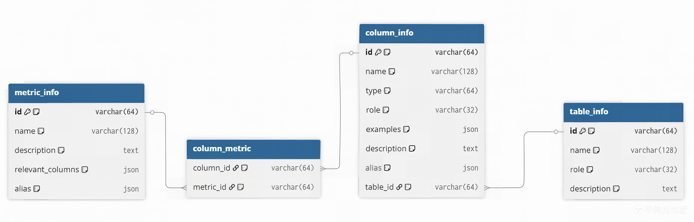
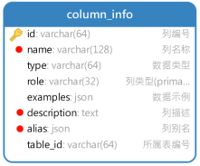
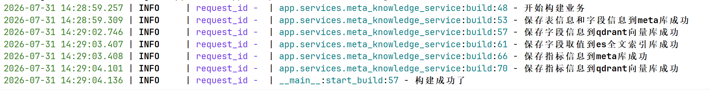

# 元数据知识库

## 1. 需求说明

本章旨在开发一个用于构建元数据知识库的脚本。该脚本以一个 YAML 配置文件作为输入参数，配置文件中定义了需要同步至元数据知识库的表格信息与指标信息。脚本功能包括：

-  根据配置内容，将指定的表及指标信息同步至 Meta 数据库；

-  为字段信息和指标信息构建向量索引；

-  为字段取值建立全文索引。


## 2. 代码组织规划

构建元数据知识库模块的核心代码采用分层设计，具体组织结构如下：

```bash
data-agent/
├── conf/
│   └── meta_config.yaml # 配置文件，用于指定待同步的表格和指标
└── app/
    ├── conf/
    │   └── meta_config.py # 用于定义meta_config.yaml的参数结构
    ├── scripts/
    │   └── build_meta_knowledge.py # 构建元数据知识库的入口脚本，负责解析命令行参数
    ├── services/
    │   └── meta_knowledge_service.py # 负责实现构建元数据知识库的核心逻辑
    ├── models/ 
        ├── mysql/
        │   ├── base.py # 所有模型类的基类
        │   ├── column_info_mysql.py # 与column_info表对应的模型类
        │   ├── column_metric_mysql.py # 与column_metric表对应的模型类
        │   ├── metric_info_mysql.py # 与metric_info表对应的模型类
        │   └── table_info_mysql.py # 与table_info表对应的模型类
        ├── qdrant/
        │   ├── column_info_qdrant.py # 字段信息的qdrant操作的模型类
        │   └── metric_info_qdrant.py # 指标信息的qdrant操作的模型类
        └── es/
            └── value_info_es.py # 字段取值的ES操作的模型类
    └── repositories/
        ├── mysql/
        │   ├── meta_mysql_repository.py # 负责实现meta数据库的读写操作
        │   └── dw_mysql_repository.py # 负责实现dw数据库的读写操作
        ├── qdrant/
        │   ├── column_qdrant_repository.py # 负责实现qdrant中column相关集合的读写操作
        │   └── metric_qdrant_repository.py # 负责实现qdrant中metric相关集合的读写操作
        └── es/
            └── value_es_repository.py # 负责实现es中value索引的读写操作
```

## 3. 具体实现

### 3.1. 配置文件

#### 3.1.1. 结构说明

配置文件采用yaml格式，用于指定待同步的表格和指标信息，其结构要求如下

```yaml
tables: # 表格信息
    - name: <table_name> # 真实表名
      role: dim | fact # 表角色
      description: <table_description> # 表的业务含义说明
      columns:
          - name: <column_name> # 真实字段名
            role: primary_key | foreign_key | dimension | measure # 字段角色 
            description: <column_description> # 字段的业务含义
            alias: [<alias1>, <alias2>] # 字段同义词
            sync: true | false # 该字段取值是否需要同步到ES建立全文索引

metrics: # 指标信息
    - name: <metric_name> # 指标名称，如 GMV、AOV
      description: <metric_description> # 指标的业务含义与计算口径说明
      relevant_columns: [<table_name.column_name>] # 指标相关字段
      alias: [<alias1>, <alias2>] # 指标同义词
```

#### 3.1.2. 具体配置

当前的数据仓库模拟环境（dw库）中共有 5 张表和 2 个指标需要同步到元数据知识库，具体配置如下。





**说明：**该配置文件应由脚本调用方提供，所以该文件在项目中的路径不做要求，现暂将其置于`data-agent/conf/meta_config.yaml`中。

```yaml
# 需要同步到meta数据库的表信息及表的字段信息
# 表信息 =》保存到table_info表
# 字段信息 =》保存到column_info表
tables:
  - name: dim_region
    role: dim
    description: 地区维度表，用于描述订单发生的地理区域信息。
    columns:
      - name: region_id
        role: primary_key
        description: 地区唯一标识。
        alias: [ 地区ID, 区域ID ]
        sync: false

      - name: province
        role: dimension
        description: 订单所属的省份名称。
        alias: [ 省份, 省, 所在省份 ]
        sync: true

      - name: region_name
        role: dimension
        description: 订单所属的大区名称，如华东、华南等。
        alias: [ 地区, 区域, 大区 ]
        sync: true

      - name: country
        role: dimension
        description: 地区所属国家名称。
        alias: [ 国家, 国家名称 ]
        sync: true


  - name: dim_customer
    role: dim
    description: 客户维度表，描述下单客户的基本属性。
    columns:
      - name: customer_id
        role: primary_key
        description: 客户唯一标识。
        alias: [ 客户ID, 用户ID ]
        sync: false

      - name: customer_name
        role: dimension
        description: 客户名称。
        alias: [ 客户名称, 用户名称 ]
        sync: true

      - name: gender
        role: dimension
        description: 客户性别。
        alias: [ 性别 ]
        sync: true

      - name: member_level
        role: dimension
        description: 客户会员等级。
        alias: [ 会员等级, 用户等级 ]
        sync: true


  - name: dim_product
    role: dim
    description: 商品维度表，描述商品的基本属性信息。
    columns:
      - name: product_id
        role: primary_key
        description: 商品唯一标识。
        alias: [ 商品ID, 产品ID ]
        sync: false

      - name: product_name
        role: dimension
        description: 商品名称。
        alias: [ 商品名称, 产品名称 ]
        sync: true

      - name: category
        role: dimension
        description: 商品所属品类。
        alias: [ 商品类别, 品类, 分类 ]
        sync: true

      - name: brand
        role: dimension
        description: 商品品牌名称。
        alias: [ 品牌, 品牌名称 ]
        sync: true


  - name: dim_date
    role: dim
    description: 时间维度表，用于多时间粒度分析。
    columns:
      - name: date_id
        role: primary_key
        description: 日期唯一标识，格式 yyyyMMdd。
        alias: [ 日期ID, 日期 ]
        sync: true

      - name: year
        role: dimension
        description: 年份。
        alias: [ 年, 年份 ]
        sync: false

      - name: quarter
        role: dimension
        description: 季度。
        alias: [ 季度 ]
        sync: true

      - name: month
        role: dimension
        description: 月份。
        alias: [ 月, 月份 ]
        sync: true

      - name: day
        role: dimension
        description: 日。
        alias: [ 日, 天 ]
        sync: true

  - name: fact_order
    role: fact
    description: 订单事实表，记录订单数量和金额等核心指标。
    columns:
      - name: order_id
        role: primary_key
        description: 订单唯一标识。
        alias: [ 订单ID ]
        sync: false

      - name: customer_id
        role: foreign_key
        description: 关联客户维度的外键。
        alias: [ 客户ID, 用户ID ]
        sync: false

      - name: product_id
        role: foreign_key
        description: 关联商品维度的外键。
        alias: [ 商品ID, 产品ID ]
        sync: false

      - name: date_id
        role: foreign_key
        description: 关联时间维度的外键。
        alias: [ 日期, 下单日期 ]
        sync: false

      - name: region_id
        role: foreign_key
        description: 关联地区维度的外键。
        alias: [ 地区ID, 区域ID ]
        sync: false

      - name: order_quantity
        role: measure
        description: 订单中商品的购买数量。
        alias: [ 销量, 购买数量, 件数 ]
        sync: false

      - name: order_amount
        role: measure
        description: 订单金额。
        alias: [ 销售额, 订单金额, 收入 ]
        sync: false

# 需要同步到meta库的指标信息
# 指标信息 =》保存到metric_info表
# metric_info的id和column_info的id => 保存到column_metric表中
metrics:
  - name: GMV
    description: 全称Gross Merchandise Value，表示所有订单的成交金额总和。
    relevant_columns:
      - fact_order.order_amount
    alias: [ 成交总额, 订单总额 ]
  - name: AOV
    description: 全称Average Order Value，表示所有订单的成交金额平均值。
    relevant_columns:
      - fact_order.order_amount
      - fact_order.order_quantity
    alias: [ 平均单价, 平均订单金额 ]

```

### 3.2. 解析配置文件的模块

在`data-agent/app/conf/meta_config.py`中编写如下内容，用于定义上述配置参数的结构和解析。

```python
from dataclasses import dataclass
from pathlib import Path
from omegaconf import OmegaConf

# ==================== 字段信息配置模型 ====================
@dataclass
class ColumnConfig:
    name: str
    role: str
    description: str
    alias: list[str]
    sync: bool

# ==================== 表信息配置模型 ====================
@dataclass
class TableConfig:
    name: str
    role: str
    description: str
    columns: list[ColumnConfig]

# ==================== 指标信息配置模型 ====================
@dataclass
class MetricConfig:
    name: str
    description: str
    relevant_columns: list[str]
    alias: list[str]

# ==================== 元数据的总配置模型 ====================
@dataclass
class MetaConfig:
    tables: list[TableConfig]
    metrics: list[MetricConfig]

# 得到yaml配置文件的绝对路径
_yaml_path = Path(__file__).parents[2] / "conf" / "meta_config.yaml"

# 根据路径加载配置文件数据 =》DictConfig对象
_yaml_data = OmegaConf.load(_yaml_path)

# 将数据转换为MetaConfig类型的对象
meta_config: MetaConfig = OmegaConf.to_object(OmegaConf.merge(MetaConfig, _yaml_data))

if __name__ == "__main__":
    print(meta_config)
    print(meta_config.metrics[0].description)

```

### 3.3. 入口脚本

入口脚本（`data-agent/app/scripts/build_meta_knowledge.py`）调用元知识库构建的业务模块`meta_knowledge_service`的build方法来启动元知识库构建的业务流程

~~~python
import asyncio

from sqlalchemy.ext.asyncio import AsyncSession

from app.clients.embedding_client_manager import embedding_client_manager
from app.clients.es_client_manager import es_client_manager
from app.clients.mysql_client_manager import dw_mysql_client_manager, meta_mysql_client_manager
from app.clients.qdrant_client_manager import qdrant_client_manager
from app.conf.meta_config import meta_config
from app.core.log import logger
from app.repositories.es.value_es_repository import ValueESRepository
from app.repositories.mysql.dw_mysql_repository import DWMysqlRepository
from app.repositories.mysql.meta_mysql_repository import MetaMysqlRepository
from app.repositories.qdrant.column_qdrant_repository import ColumnQdrantRepository
from app.repositories.qdrant.metric_qdrant_repository import MetricQdrantRepository
from app.services.meta_knowledge_service import MetaKnowledgeService

"""
1. 初始所有客户端管理器
2. 创建构建的业务对象,要准备
    创建依赖的所有持久层对象，传入依赖的session或client
    用来生成向量的客户端
3. 调用业务对象的构建方法来构建知识库
4. 如果成功了，提交事务
5。如果失败了，回滚事务
6. 最终都要关闭客户端管理器
"""
async def start_build():

    # 1. 初始所有客户端管理器
    embedding_client_manager.init()
    es_client_manager.init()
    dw_mysql_client_manager.init()
    meta_mysql_client_manager.init()
    qdrant_client_manager.init()

    try:
        # 2. 创建构建的业务对象
        async with (dw_mysql_client_manager.session_factory() as dw_session,
                    meta_mysql_client_manager.session_factory() as meta_session):
            dw_session: AsyncSession
            meta_session: AsyncSession

            service = MetaKnowledgeService(
                dw_mysql_repo=DWMysqlRepository(dw_session),
                meta_myql_repo=MetaMysqlRepository(meta_session),
                value_es_repo=ValueESRepository(es_client_manager.client),
                column_qdrant_repo=ColumnQdrantRepository(qdrant_client_manager.client),
                metric_qdrant_repo=MetricQdrantRepository(qdrant_client_manager.client),
                embedding_client=embedding_client_manager.client
            )
            # 3. 调用构建方法
            await service.build(meta_config)
            # 4. 如果成功了，提交事务
            await dw_session.commit()
            await meta_session.commit()
            logger.info("构建成功了")

    except Exception as e:
        # 5。如果失败了，回滚事务
        await dw_session.rollback()
        await meta_session.rollback()
        logger.error(f"构建知识库失败： {str(e)}")
        raise   # 方便查看异常具体情况
    finally:
        # 6. 最终都要关闭客户端管理器
        await es_client_manager.close()
        await dw_mysql_client_manager.close()
        await meta_mysql_client_manager.close()
        await qdrant_client_manager.close()

if __name__ == "__main__":
    asyncio.run(start_build())
~~~


### 3.4. 核心业务模块

核心业务逻辑位于`data-agent/app/services/meta_knowledge_service.py`中，具体内容如下：

主要实现思路
~~~python
import uuid

from langchain_huggingface import HuggingFaceEndpointEmbeddings

from app.conf.meta_config import MetaConfig, TableConfig, MetricConfig
from app.core.log import logger
from app.models.es.value_info_es import ValueInfoES
from app.models.mysql.column_info_mysql import ColumnInfoMySQL
from app.models.mysql.column_metric_mysql import ColumnMetricMySQL
from app.models.mysql.metric_info_mysql import MetricInfoMySQL
from app.models.mysql.table_info_mysql import TableInfoMySQL
from app.models.qdrant.column_info_qdrant import ColumnInfoQdrant
from app.models.qdrant.metric_info_qdrant import MetricInfoQdrant
from app.repositories.es.value_es_repository import ValueESRepository
from app.repositories.mysql.dw_mysql_repository import DWMysqlRepository
from app.repositories.mysql.meta_mysql_repository import MetaMysqlRepository
from app.repositories.qdrant.column_qdrant_repository import ColumnQdrantRepository
from app.repositories.qdrant.metric_qdrant_repository import MetricQdrantRepository

"""
构建元数据知识库的业务类
"""
class MetaKnowledgeService:
    def __init__(self,
                 dw_mysql_repo: DWMysqlRepository,
                 meta_myql_repo: MetaMysqlRepository,
                 value_es_repo: ValueESRepository,
                 column_qdrant_repo: ColumnQdrantRepository,
                 metric_qdrant_repo: MetricQdrantRepository,
                 embedding_client: HuggingFaceEndpointEmbeddings):
        self.dw_mysql_repo = dw_mysql_repo
        self.meta_myql_repo = meta_myql_repo
        self.value_es_repo = value_es_repo
        self.column_qdrant_repo = column_qdrant_repo
        self.metric_qdrant_repo = metric_qdrant_repo
        self.embedding_client = embedding_client

    """
    # 1. 处理表相关的信息
    # 1.1 将表的信息和字段的信息保存到meta库（tableinfo和column_info表）
    # 1.2 对所有字段信息建立向量索引
    # 1.3 对象字段取值建立全文索引
    # 2. 处理指标信息
    # 2.1 将指标信息数据保存到meta库（metric_info和culumn_metric表）
    # 2.2 对指标信息建立向量索引
    """
    async def build(self, config: MetaConfig):
        logger.info("开始构建业务")
        # 1. 处理表相关的信息
        if config.tables:
            # 1.1 将表的信息和字段的信息保存到meta库（tableinfo和column_info表）
            column_infos:list[ColumnInfoMySQL] = await self._save_table_infos_to_meta_db(config.tables)
            logger.info("保存表信息和字段信息到meta库成功")

            # 1.2 对所有字段信息建立向量索引
            await self._save_column_infos_to_qdrant(column_infos)
            logger.info("保存字段信息到qdrant向量库成功")

            # 1.3 对象字段取值建立全文索引
            await self._save_column_values_to_es(column_infos, config.tables)
            logger.info("保存字段取值到es全文索引库成功")
        # 2. 处理指标信息
        if config.metrics:
            # 2.1 将指标信息数据保存到meta库（metric_info和culumn_metric表）
            metric_infos: list[MetricInfoMySQL] = self._save_metric_infos_to_meta_db(config.metrics)
            logger.info("保存指标信息到meta库成功")

            # 2.2 对指标信息建立向量索引
            await self._save_metric_infos_to_qdrant(metric_infos)
            logger.info("保存指标信息到qdrant向量库成功")

    """
    遍历tables中所有表的信息数据，封装成表信息对象的数组table_infos  调用持久层保存到table_info表
    遍历所有表中字段的信息数据，封装成字段信息对象的数组column_infos  调用持久层保存到column_info表
    """
    async def _save_table_infos_to_meta_db(self, tables: list[TableConfig])->list[ColumnInfoMySQL]:
        """将表的信息和字段的信息保存到meta库（tableinfo和column_info表）"""
        # 准备容器
        table_infos: list[TableInfoMySQL] = []
        column_infos:list[ColumnInfoMySQL] = []
        # 遍历, 创建对象，添加到列表
        for table in tables:
            table_info = TableInfoMySQL(
                id=table.name,
                name=table.name,
                role=table.role,
                description=table.description
            )
            table_infos.append(table_info)
            # 查询dw中指定表的所有字段类型 dict[字段名:字段类型]
            column_type_dict: dict[str,str] = await self.dw_mysql_repo.get_column_types(table_info.name)

            # 遍历字段信息, 创建ORM对象
            for column in table.columns:
                # 查询dw库，取出指定字段的前10条数据
                examples: list = await self.dw_mysql_repo.get_column_values(table_info.name, column.name)

                column_info = ColumnInfoMySQL(
                    id=f"{table.name}.{column.name}",
                    name=column.name,
                    type=column_type_dict[column.name],  # 需要检查表中字段类型
                    role=column.role,
                    examples=examples, # 需要查表
                    description=column.description,
                    alias=column.alias,
                    table_id=table_info.id
                )
                column_infos.append(column_info)

        # 保存到数据库
        self.meta_myql_repo.save_table_infos(table_infos)
        self.meta_myql_repo.save_column_infos(column_infos)
        # 返回column_infos
        return column_infos

    """
    遍历每个column_info,对其name,description,alias中每个alia生成向量
    为每个向量生成对应的id和payload(是包含所有column_info中所有数据的字典对象)
    调用持久层保存到向量库
    """
    async def _save_column_infos_to_qdrant(self, column_infos: list[ColumnInfoMySQL]):
        # 准备一个数组容器，存储一个字典对象（id, payload, 待向量化文本）
        data_dict_list: list[dict] = []
        # 遍历column_infos，创建一个字典对象，指定相应的属性，添加到数组中
        for column_info in column_infos:
            column_info_qdrant = ColumnInfoQdrant(
                id=column_info.id,
                name=column_info.name,
                type=column_info.type,
                role=column_info.role,
                examples=column_info.examples,
                description=column_info.description,
                alias=column_info.alias,
                table_id=column_info.table_id
            )
            # name
            data_dict_list.append({
                "id": uuid.uuid4(),
                "embedding_text": column_info.name,
                "payload": column_info_qdrant
            })
            # description
            data_dict_list.append({
                "id": uuid.uuid4(),
                "embedding_text": column_info.description,
                "payload": column_info_qdrant
            })
            # alias
            for alia in column_info.alias:
                data_dict_list.append({
                    "id": uuid.uuid4(),
                    "embedding_text": alia,
                    "payload": column_info_qdrant
                })

        # 取出所有待向量化的文本对其进行批量向量化（需要分处理），得到包含所有向量列表： vectors: list[list[float]]
        embeddint_texts = [data_dict["embedding_text"] for data_dict in data_dict_list]
        batch_size = 32
        vectors: list[list[float]] = []
        for i in range(0, len(embeddint_texts), batch_size):
            batch_embeddint_texts = embeddint_texts[i:i+batch_size]
            batch_vectors: list[list[float]] = await self.embedding_client.aembed_documents(batch_embeddint_texts)
            # vectors.append(batch_vectors)  # 不可以，多了一层嵌套
            vectors.extend(batch_vectors)

        # 从上面的数组容器中取出所有id组成数组：ids: list[str]
        ids: list[str] = [data_dict["id"] for data_dict in data_dict_list]

        # 从上面的数组容器中取出所有payload组成数组：payloads: list[dict]
        payloads: list[dict] = [data_dict["payload"] for data_dict in data_dict_list]

        # 调用持久层保存到向量库
        await self.column_qdrant_repo.upsert_column_vectors(vectors, payloads, ids)

    """
    从column_infos中遍历所有字段，只有配置为需要索引才进行下面的处理
        查询dw库得到字段的所有值，对每个值，创建一个ValueInfoES对象封装相关信息数据  value_infos:list[ValueInfoES]
    调用持久层保存数据到ES中
    """
    async def _save_column_values_to_es(self, column_infos: list[ColumnInfoMySQL], tables: list[TableConfig]):
        """对象字段取值建立全文索引"""

        # 收集配置中所有字段的sync: dict[column_id, bool]
        column_sync_dict: dict[str, bool] = {}
        for table in tables:
            for column in table.columns:
                column_sync_dict[f"{table.name}.{column.name}"] = column.sync

        # 遍历所有字段信息，只有sync为True的，才创建对应的ValueInfoES对象添加到列表中
        value_infos: list[ValueInfoES] = []
        for column_info in column_infos:
            sync = column_sync_dict[column_info.id]
            if sync:
                # 查询dw库得到字段的所有值，对每个值，创建一个ValueInfoES对象封装相关信息数据  value_infos:list[ValueInfoES]
                values = await self.dw_mysql_repo.get_column_values(column_info.table_id, column_info.name, 100000)
                for value in values:
                    value_infos.append(ValueInfoES(
                        id=f"{column_info.id}.{value}",
                        value=value,
                        type=column_info.type,
                        column_id=column_info.id,
                        column_name=column_info.name,
                        table_id=column_info.table_id,
                        table_name=column_info.table_id
                    ))
        # 调用持久层保存数据到ES中
        await self.value_es_repo.insert_values(value_infos)


    def _save_metric_infos_to_meta_db(self, metrics: list[MetricConfig])->list[MetricInfoMySQL]:
        """将指标信息数据保存到meta库（metric_info和culumn_metric表）"""
        metric_infos: list[MetricInfoMySQL] = []
        column_metrics: list[ColumnMetricMySQL] = []

        for metric in metrics:
            metric_infos.append(MetricInfoMySQL(
                id=metric.name,
                name=metric.name,
                description=metric.description,
                relevant_columns=metric.relevant_columns,
                alias=metric.alias
            ))
            for column_id in metric.relevant_columns:
                column_metrics.append(ColumnMetricMySQL(
                    column_id=column_id,
                    metric_id=metric.name
                ))
        self.meta_myql_repo.save_metric_infos(metric_infos)
        self.meta_myql_repo.save_column_metrics(column_metrics)

        return metric_infos


    async def _save_metric_infos_to_qdrant(self, metric_infos:list[MetricInfoMySQL]):
        """对指标信息建立向量索引"""
        # 准备一个数组容器，存储一个字典对象（id, payload, 待向量化文本）
        data_dict_list: list[dict] = []
        # 遍历column_infos，创建一个字典对象，指定相应的属性，添加到数组中
        for metric_info in metric_infos:
            metric_info_qdrant = MetricInfoQdrant(
                id=metric_info.id,
                name=metric_info.name,
                description=metric_info.description,
                alias=metric_info.alias,
                relevant_columns=metric_info.relevant_columns
            )
            # name
            data_dict_list.append({
                "id": uuid.uuid4(),
                "embedding_text": metric_info.name,
                "payload": metric_info_qdrant
            })
            # description
            data_dict_list.append({
                "id": uuid.uuid4(),
                "embedding_text": metric_info.description,
                "payload": metric_info_qdrant
            })
            # alias
            for alia in metric_info.alias:
                data_dict_list.append({
                    "id": uuid.uuid4(),
                    "embedding_text": alia,
                    "payload": metric_info_qdrant
                })

        # 取出所有待向量化的文本对其进行批量向量化（需要分处理），得到包含所有向量列表： vectors: list[list[float]]
        embeddint_texts = [data_dict["embedding_text"] for data_dict in data_dict_list]
        batch_size = 32
        vectors: list[list[float]] = []
        for i in range(0, len(embeddint_texts), batch_size):
            batch_embeddint_texts = embeddint_texts[i:i + batch_size]
            batch_vectors: list[list[float]] = await self.embedding_client.aembed_documents(batch_embeddint_texts)
            # vectors.append(batch_vectors)  # 不可以，多了一层嵌套
            vectors.extend(batch_vectors)

        # 从上面的数组容器中取出所有id组成数组：ids: list[str]
        ids: list[str] = [data_dict["id"] for data_dict in data_dict_list]

        # 从上面的数组容器中取出所有payload组成数组：payloads: list[dict]
        payloads: list[dict] = [data_dict["payload"] for data_dict in data_dict_list]

        # 调用持久层保存到向量库
        await self.metric_qdrant_repo.upsert_metric_vectors(vectors, payloads, ids)
~~~


业务逻辑实现：

```python
"""
构建元数据知识库的业务层类
接收的参数：
    dw_mysql_repo: 操作mysql的dw库的持久层对象
    meta_mysql_repo: 操作mysql的meta库的持久层对象
    value_es_repo: 操作es库的持久层对象
    column_qdrant_repo: 操作qdrant中的column集合的持久层对象
    metric_qdrant_repo：操作qdrant中的metric集合的持久层对象
    embedding_client: 生成向量数据的客户端对象
"""
import uuid

from langchain_huggingface import HuggingFaceEndpointEmbeddings

from app.conf.meta_config import MetaConfig, TableConfig, MetricConfig
from app.core.log import logger
from app.models.es.value_info_es import ValueInfoES
from app.models.mysql.column_info_mysql import ColumnInfoMySQL
from app.models.mysql.column_metric_mysql import ColumnMetricMySQL
from app.models.mysql.metric_info_mysql import MetricInfoMySQL
from app.models.mysql.table_info_mysql import TableInfoMySQL
from app.models.qdrant.column_info_qdrant import ColumnInfoQdrant
from app.models.qdrant.metric_info_qdrant import MetricInfoQdrant
from app.repositories.es.value_es_repository import ValueESRepository
from app.repositories.mysql.dw_mysql_repository import DWMysqlRepository
from app.repositories.mysql.meta_mysql_repository import MetaMysqlRepository
from app.repositories.qdrant.column_qdrant_repository import ColumnQdrantRepository
from app.repositories.qdrant.metric_qdrant_repository import MetricQdrantRepository


class MetaKnowledgeService:
    """构建元数据知识库的业务类"""

    def __init__(self,
                 dw_mysql_repo: DWMysqlRepository,
                 meta_mysql_repo: MetaMysqlRepository,
                 value_es_repo: ValueESRepository,
                 column_qdrant_repo: ColumnQdrantRepository,
                 metric_qdrant_repo: MetricQdrantRepository,
                 embedding_client: HuggingFaceEndpointEmbeddings):
        self.dw_mysql_repo = dw_mysql_repo
        self.meta_mysql_repo = meta_mysql_repo
        self.value_es_repo = value_es_repo
        self.column_qdrant_repo = column_qdrant_repo
        self.metric_qdrant_repo = metric_qdrant_repo
        self.embedding_client = embedding_client

    """
    构建的整体流程
    # 1. 处理表相关信息数据
        # 1.1 保存表信息和字段信息到meta库
        # 1.2 为字段信息建立向量索引
        # 1.3 为字段取值建立全文索引
    # 2. 处理指标相关信息数据
        # 2.1 保存指标信息到meta库
        # 2.2 为指标信息建立向量索引
    """
    async def build(self, config: MetaConfig):
        """构建元数据知识库的业务方法"""
        logger.info("开始构建元数据知识库")

        # 1. 处理表相关信息数据
        if config.tables:
            pass
            # 1.1 保存表信息和字段信息到meta库
            column_infos:list[ColumnInfoMySQL] = await self._save_table_infos_to_meta_db(config.tables)
            logger.info("保存表信息和字段信息到meta库成功")

            # 1.2 为字段信息建立向量索引
            await self._save_column_infos_to_qdrant(column_infos)
            logger.info("为字段信息建立向量索引成功")

            # 1.3 为字段取值建立全文索引
            await self._save_value_infos_to_es(config.tables, column_infos)
            logger.info("为字段取值建立全文索引成功")
        # 2. 处理指标相关信息数据
        if config.metrics:
            # 2.1 保存指标信息到meta库
            metric_infos: list[MetricInfoMySQL] = await self._save_metric_infos_to_meta_db(config.metrics)
            logger.info("保存指标信息到meta库成功")

            # 2.2 为指标信息建立向量索引
            await self._save_metric_infos_to_qdrant(metric_infos)
            logger.info("为指标信息建立向量索引成功")

    """
    保存表信息和字段信息到meta库
        遍历表配置：生成表信息对象的列表，保存到meta库中的table_info表中    
        遍历每个表的字段配置：生成字段信息对象的列表，保存到meta库中的column_info表中
                            中间需要查询dw库，获取表的所有字段的类型和字段的前10个值
    """
    async def _save_table_infos_to_meta_db(self, tables: list[TableConfig])-> list[ColumnInfoMySQL]:
        """保存表信息和字段信息到meta库"""
        # 准备存储表信息数据对象的列表
        table_infos: list[TableInfoMySQL] = []
        # 准备存储字段信息数据对象的列表
        column_infos: list[ColumnInfoMySQL] = []
        # 根据tables配置来创建表信息数据对象和字段信息数据对象，并添加到对应的列表中
        for table in tables:
            table_info = TableInfoMySQL(
                id=table.name,
                name=table.name,
                role=table.role,
                description=table.description
            )
            table_infos.append(table_info)
            # 查询dw库，获取当前表的所有字段的类型   字典结构，{字段名：字段类型}
            column_types: dict[str, str] = await self.dw_mysql_repo.get_column_types(table.name)
            # logger.info(f"字段类型列表：{column_types}" )
            for column in table.columns:
                # 查询dw库，获取当前字段的前10条值
                column_vales: list[str] = await self.dw_mysql_repo.get_column_values(table.name, column.name)
                # logger.info(f"字段值列表：{column_vales}" )
                column_info = ColumnInfoMySQL(
                    id=f"{table_info.id}.{column.name}",
                    name=column.name,
                    type=column_types[column.name],
                    role=column.role,
                    examples=column_vales,
                    description=column.description,
                    alias=column.alias,
                    table_id=table_info.id
                )
                column_infos.append(column_info)

        # 将table_infos保存到meta库的table_info表中
        self.meta_mysql_repo.save_table_infos(table_infos)

        # 将column_infos保存到meta库的column_info表中
        self.meta_mysql_repo.save_column_infos(column_infos)

        # 返回column_infos （外部后面的流程需要）
        return column_infos


    """
        对所有字段信息进行批量向量化，只向量化字段的name/description/alias
        将向量化的数据和字段信息存储到qdrant向量数据库
    """
    async def _save_column_infos_to_qdrant(self, column_infos: list[ColumnInfoMySQL]):
        """为字段信息建立向量索引"""

        pointers: list[dict] = []
        for item in column_infos:
            # name
            pointers.append({
                "id": uuid.uuid4(),
                "embedding_text": item.name,
                "payload": MetaKnowledgeService._convert_comlumn_info_to_qdrant(item)
            })
            # description
            pointers.append({
                "id": uuid.uuid4(),
                "embedding_text": item.description,
                "payload": MetaKnowledgeService._convert_comlumn_info_to_qdrant(item)
            })
            # alias
            for alia in item.alias:
                pointers.append({
                    "id": uuid.uuid4(),
                    "embedding_text": alia,
                    "payload": MetaKnowledgeService._convert_comlumn_info_to_qdrant(item)
                })
        # 需要进行向量化的所有文本列表
        embedding_texts = [item["embedding_text"] for item in pointers]
        # 批量生成向量
        # 直接将全部embedding_texts向量化，速度会很慢，不合适，需要分批次向量化
        # embeddings = await self.embedding_client.embed_documents(embedding_texts)
        # 每批32个
        batch_size = 32 # 每批向量化的向量数量
        embeddings: list[list[float]] = []
        for i in range(0, len(embedding_texts), batch_size):
            batch_embedding_texts = embedding_texts[i:i+batch_size]
            # 向量化  list[list[float]]
            batch_embeddings = await self.embedding_client.aembed_documents(batch_embedding_texts)
            # embeddings.append(batch_embeddings)  # 不可以，不能再嵌套
            embeddings.extend(batch_embeddings) # 将当前数组中的所有元素添加到列表末尾
        # 获取所有id
        ids = [item["id"] for item in pointers]
        # 获取所有payload
        payloads = [item["payload"] for item in pointers]
        # 保存已向量化的字段信息到向量数据库
        await self.column_qdrant_repo.upsert_column_embeddings(ids, embeddings, payloads)


    @staticmethod
    def _convert_comlumn_info_to_qdrant(column_info: ColumnInfoMySQL) -> ColumnInfoQdrant:
        """
        根据字段信息对象生成字段信息的qdrant对象
        """
        return ColumnInfoQdrant(
            id=column_info.id,
            name=column_info.name,
            type=column_info.type,
            role=column_info.role,
            examples=column_info.examples,
            alias=column_info.alias,
            table_id=column_info.table_id,
            description=column_info.description
        )


    """
        遍历tables配置中所有表中的所有需要索引的字段，查出每个字段的所有数据，封装成字段值信息对象列表
        将字段值信息列表保存到ES中
    """
    async def _save_value_infos_to_es(self, tables:list[TableConfig], column_infos:list[ColumnInfoMySQL]):
        """为字段取值建立全文索引"""

        # 生成所有字段id与是否需要索引的字典
        column_sync_dict: dict[str, bool] = {}
        for table in tables:
            for column in table.columns:
                column_sync_dict[f"{table.name}.{column.name}"] = column.sync

        value_infos: list[ValueInfoES] = []
        for column_info in column_infos:
            # 只有配置为sync为true的字段才需要索引
            sync = column_sync_dict[column_info.id]
            if sync:
                # 获取指定字段的所有值
                column_values = await self.dw_mysql_repo.get_column_values(
                    table_name=column_info.table_id,
                    column_name=column_info.name,
                    limit=10000
                )
                for column_value in column_values:
                    value_infos.append(ValueInfoES(
                        id=f"{column_info.id}.{column_value}",
                        value=column_value,
                        type=column_info.type,
                        column_id=column_info.id,
                        column_name=column_info.name,
                        table_id=column_info.table_id,
                        table_name=column_info.table_id
                    ))

        # 保存数据到ES
        await self.value_es_repo.upsert_values(value_infos)

    """
        根据配置指标信息数据，生成指标信息的列表
        将指标信息列表保存到meta库的metric_info表中
        同时要将指标id和对应的字段id保存到column_metric表中
    """
    async def _save_metric_infos_to_meta_db(self, metrics:list[MetricConfig]) -> list[MetricInfoMySQL]:
        """保存指标信息到meta库"""
        metric_infos: list[MetricInfoMySQL] = []
        column_metrics: list[ColumnMetricMySQL] = []
        for metric in metrics:
            metric_infos.append(MetricInfoMySQL(
                id=metric.name,
                name=metric.name,
                description=metric.description,
                relevant_columns=metric.relevant_columns,
                alias=metric.alias
            ))
            for column_id in metric.relevant_columns:
                column_metrics.append(ColumnMetricMySQL(
                    metric_id=metric.name,
                    column_id=column_id
                ))
        self.meta_mysql_repo.save_metric_infos(metric_infos)
        self.meta_mysql_repo.save_column_metrics(column_metrics)
        return metric_infos

    """
        对所有指标信息进行批量向量化，只向量化字段的name/description/alias
        将向量化的数据和字段信息存储到qdrant向量数据库
    """
    async def _save_metric_infos_to_qdrant(self, metric_infos:list[MetricInfoMySQL]):
        """为指标信息建立向量索引"""
        points: list[dict] = []
        for item in metric_infos:
            # name
            points.append({
                "id": uuid.uuid4(),
                "embedding_text": item.name,
                "payload": MetaKnowledgeService._convert_metric_infos_to_qdrant(item)
            })
            # description
            points.append({
                "id": uuid.uuid4(),
                "embedding_text": item.description,
                "payload": MetaKnowledgeService._convert_metric_infos_to_qdrant(item)
            })
            # alias
            for alia in item.alias:
                points.append({
                    "id": uuid.uuid4(),
                    "embedding_text": alia,
                    "payload": MetaKnowledgeService._convert_metric_infos_to_qdrant(item)
                })
        # 需要进行向量化的所有文本列表
        embedding_texts = [item["embedding_text"] for item in points]
        # 批量生成向量
        # 直接将全部embedding_texts向量化，速度会很慢，不合适，需要分批次向量化
        # embeddings = await self.embedding_client.embed_documents(embedding_texts)
        # 每批32个
        batch_size = 32  # 每批向量化的向量数量
        embeddings: list[list[float]] = []
        for i in range(0, len(embedding_texts), batch_size):
            batch_embedding_texts = embedding_texts[i:i + batch_size]
            # 向量化  list[list[float]]
            batch_embeddings = await self.embedding_client.aembed_documents(batch_embedding_texts)
            # embeddings.append(batch_embeddings)  # 不可以，不能再嵌套
            embeddings.extend(batch_embeddings)  # 将当前数组中的所有元素添加到列表末尾
        # 获取所有id
        ids = [item["id"] for item in points]
        # 获取所有payload
        payloads = [item["payload"] for item in points]
        # 保存已向量化的字段信息到向量数据库
        await self.metric_qdrant_repo.upsert_metric_embeddings(ids, embeddings, payloads)

    @staticmethod
    def _convert_metric_infos_to_qdrant(metric_info: MetricInfoMySQL)->MetricInfoQdrant:
        return MetricInfoQdrant(
            id=metric_info.id,
            name=metric_info.name,
            description=metric_info.description,
            relevant_columns=metric_info.relevant_columns,
            alias=metric_info.alias
        )

```


### 3.5. 数据读写操作

#### 3.5.1. 业务实体类

业务实体类用于统一封装不同存储系统中的数据结构（如 Meta 数据库、Elasticsearch、Qdrant），作为应用上层组件进行读写操作时的标准参数类型和返回值类型。本项目定义的业务实体有：ValueInfoES、ColumnInfoQdrant、MetricInfoQdrant具体代码如下： 

- ValueInfoES（data-agent\app\models\es\value_info_es.py）

  ```python
  from typing import TypedDict
  
  class ValueInfoES(TypedDict):
      id:str
      value:str
      type:str
      column_id:str
      column_name:str
      table_id:str
      table_name:str
  
  ```
  
- ColumnInfoQdrant（data-agent\app\models\qdrant\column_info_qdrant.py）

  ```python
  from typing import TypedDict
  
  class ColumnInfoQdrant(TypedDict):
      id:str
      name:str
      type:str
      role:str
      examples:list
      description:str
      alias:list
      table_id:str
  
  ```
  
- MetricInfoQdrant（data-agent\app\models\qdrant\metric_info_qdrant.py）

  ```python
  from typing import TypedDict
  
  class MetricInfoQdrant(TypedDict):
      id:str
      name:str
      description:str
      relevant_columns:list
      alias:list
  
  ```

#### 3.5.2. dw_mysql_repository

dw_mysql_repository用于实现数据仓库（dw库）的查询操作。

在`data-agent/app/repositories/mysql/dw/dw_mysql_repository.py`中编写如下代码：

```python
"""
操作mysql的持久层类  专门处理dw库
接收的参数：能执行数据库操作的session对象： AsyncSession类型
"""
from sqlalchemy import text
from sqlalchemy.ext.asyncio import AsyncSession


class DWMysqlRepository:
    def __init__(self, session: AsyncSession):
        self.session = session

    async def get_column_types(self, table_name: str)->dict[str,str]:
        """获取当前表的所有字段的类型"""
        # 定义查询sql
        sql = f"show columns from {table_name}"
        # 执行sql
        result = await self.session.execute(text(sql))
        # 整理数据并返回
        return {row.Field:row.Type for row in result.all()}

    async def get_column_values(self, table_name:str, column_name:str, limit:int=10) ->list:
        """查询指定字段的前limit个字段值"""
        # 定义查询sql
        sql = f"select distinct {column_name} from {table_name} limit {limit}"
        # 执行sql
        result = await self.session.execute(text(sql))
        # 整理数据并返回
        return result.scalars().all()

    async def get_db_infos(self) ->dict[str,str]:
        result = await self.session.execute(text("select version()"))
        version = result.scalar()
        dialect = self.session.get_bind().dialect.name
        return {"version":version, "dialect":dialect}

```


#### 3.5.3. meta_mysql_repository

meta_mysql_repository用于实现meta数据库的读写操作，具体代码如下：

**2）**读写操作

在`data-agent/app/repositories/mysql/meta/meta_mysql_repository.py`中编写如下代码：

```python
"""
操作mysql的持久层类  专门处理meta库
接收的参数：能执行数据库操作的session对象： AsyncSession类型
"""
from sqlalchemy import Select
from sqlalchemy.ext.asyncio import AsyncSession

from app.models.mysql.column_info_mysql import ColumnInfoMySQL
from app.models.mysql.column_metric_mysql import ColumnMetricMySQL
from app.models.mysql.metric_info_mysql import MetricInfoMySQL
from app.models.mysql.table_info_mysql import TableInfoMySQL


class MetaMysqlRepository:
    def __init__(self, session: AsyncSession):
        self.session = session

    # 向table_info表中插入多条数据
    def save_table_infos(self, table_infos: list[TableInfoMySQL]):
        self.session.add_all(table_infos)

    # 向column_info表中插入多条数据
    def save_column_infos(self, column_infos: list[ColumnInfoMySQL]):
        self.session.add_all(column_infos)

    # 向metric_info表中插入多条数据
    def save_metric_infos(self, metric_infos: list[MetricInfoMySQL]):
        self.session.add_all(metric_infos)

    # 向column_metric表中插入多条数据
    def save_column_metrics(self, column_metrics: list[ColumnMetricMySQL]):
        self.session.add_all(column_metrics)

```

#### 3.5.4. column_qdrant_repository

column_qdrant_repository用于实现qdrant中的column_info集合的读写操作。

在`data-agent/app/repositories/qdrant/column_qdrant_repository.py`中编写如下代码：

```python
"""
操作Qdrant向量索引库的持久层类  专门处理字段信息数据
接收参数： 能进行Qdrant的存储和搜索的client对象     AsyncQdrantClient类型
"""
from qdrant_client import AsyncQdrantClient, models

from app.conf.app_config import app_config
from app.models.qdrant.column_info_qdrant import ColumnInfoQdrant


class ColumnQdrantRepository:
    collection_name = "data-agent_column_collection"
    def __init__(self, client: AsyncQdrantClient):
        self.client = client

    async def _ensure_collection(self):
        client = self.client
        collection_name = self.collection_name
        # 确保集合存在：如果存在，先删除，后面创建
        if await client.collection_exists(collection_name=collection_name):
            await client.delete_collection(collection_name=collection_name)
        await client.create_collection(
            collection_name=collection_name,  # 集合名称
            vectors_config=models.VectorParams(
                size=app_config.qdrant.embedding_size,  # 向量的维度
                distance=models.Distance.COSINE  # 余弦相似匹配
            ),
        )

    async def upsert_column_vectors(self, vectors: list[list[float]],
                                    payloads: list[ColumnInfoQdrant],ids:list[str] ):
        client = self.client
        collection_name = self.collection_name

        # 确保集合存在
        await self._ensure_collection()
        """
        多个向量的数组：vectors: list[list[float]]
        多个payload的数组：payloads: list[包含字段信息的dict]
        多个向量对应的id: ids: list[str]
        """
        # 批量插入全部向量  =》问题：太多会性能下降，甚至崩溃
        # 分批批量插入多个向量
        # batch_size = 64 # 在个人电脑上不合适
        batch_size = 10
        for i in range(0, len(vectors), batch_size):
            # 得到当前批次的数据
            batch_vectors = vectors[i:i+batch_size]
            batch_payloads = payloads[i:i+batch_size]
            batch_ids = ids[i:i+batch_size]
            # 批量插入当前批次的向量数据
            await client.upsert(
                collection_name=collection_name,
                points=[
                    models.PointStruct(
                        id=batch_ids[j],
                        payload=batch_payloads[j],
                        vector=batch_vectors[j],  # 生成一个10维的向量数据
                    )
                    for j in range(len(batch_ids))
                ],
            )

```

#### 3.5.5. metric_qdrant_repository

metric_qdrant_repository用于实现qdrant中的metric_info集合的读写操作。

在`data-agent/app/repositories/qdrant/metric_qdrant_repository.py`中编写如下代码：

```python
"""
操作Qdrant向量索引库的持久层类  专门处理指标信息数据
接收参数： 能进行Qdrant的存储和搜索的client对象     AsyncQdrantClient类型
"""
from qdrant_client import AsyncQdrantClient, models

from app.conf.app_config import app_config
from app.models.qdrant.metric_info_qdrant import MetricInfoQdrant


class MetricQdrantRepository:
    collection_name = "data-agent_metric_collection"
    def __init__(self, client: AsyncQdrantClient):
        self.client = client

    async def _ensure_collection(self):
        client = self.client
        collection_name = self.collection_name
        # 确保集合存在：如果存在，先删除，后面创建
        if await client.collection_exists(collection_name=collection_name):
            await client.delete_collection(collection_name=collection_name)
        await client.create_collection(
            collection_name=collection_name,  # 集合名称
            vectors_config=models.VectorParams(
                size=app_config.qdrant.embedding_size,  # 向量的维度
                distance=models.Distance.COSINE  # 余弦相似匹配
            ),
        )

    async def upsert_metric_vectors(self, vectors: list[list[float]],
                                    payloads: list[MetricInfoQdrant],ids:list[str] ):
        client = self.client
        collection_name = self.collection_name

        # 确保集合存在
        await self._ensure_collection()
        """
        多个向量的数组：vectors: list[list[float]]
        多个payload的数组：payloads: list[包含字段信息的dict]
        多个向量对应的id: ids: list[str]
        """
        # 批量插入全部向量  =》问题：太多会性能下降，甚至崩溃
        # 分批批量插入多个向量
        # batch_size = 64 # 在个人电脑上不合适
        batch_size = 10
        for i in range(0, len(vectors), batch_size):
            # 得到当前批次的数据
            batch_vectors = vectors[i:i+batch_size]
            batch_payloads = payloads[i:i+batch_size]
            batch_ids = ids[i:i+batch_size]
            # 批量插入当前批次的向量数据
            await client.upsert(
                collection_name=collection_name,
                points=[
                    models.PointStruct(
                        id=batch_ids[j],
                        payload=batch_payloads[j],
                        vector=batch_vectors[j],  # 生成一个10维的向量数据
                    )
                    for j in range(len(batch_ids))
                ],
            )

```

#### 3.5.6. value_es_repository

value_es_repository用于实现es中的value_info index的读写操作。

在`data-agent/app/repositories/es/value_es_repository.py`中编写如下代码：

```python
"""
操作ES全文索引库的持久层类  专门处理字段值数据
接收参数： 能进行ES的存储和搜索的client对象     AsyncElasticsearch类型
"""
from elasticsearch import AsyncElasticsearch

from app.models.es.value_info_es import ValueInfoES


class ValueESRepository:
    index_name = "data-agent-value_index"
    mappings = {
        "dynamic": False,
        "properties": {
            "id": {"type": "keyword"},
            "value": {"type": "text", "analyzer": "ik_max_word", "search_analyzer": "ik_max_word"},
            "type": {"type": "keyword"},
            "column_id": {"type": "keyword"},
            "column_name": {"type": "keyword"},
            "table_id": {"type": "keyword"},
            "table_name": {"type": "keyword"},
        }
    }
    def __init__(self, client: AsyncElasticsearch):
        self.client = client

    # 确保索引存在
    async def _ensure_index(self):
        client = self.client
        index_name = self.index_name
        # 创建index
            # 测试：如果存在，删除，后面都创建
            # 生产：如果不存在才创建
        if await client.indices.exists(index=index_name):
            await client.indices.delete(index=index_name)
        await client.indices.create(
            index=index_name,
            mappings=self.mappings,
        )

    # 批量插入多个字段值信息数据
    async def insert_values(self, values: list[ValueInfoES]):
        # 确保索引存在
        await self._ensure_index()

        index_dict = {
            "index": {
                "_index": self.index_name
            }
        }

        # 将要保存的数据全部收集到operations中
        operations = []
        for value in values:
            operations.append(index_dict)
            operations.append(value)

        # 批量插入多个字段值信息数据
        # 分批批量插入
        batch_size = 10
        for i in range(0, len(operations), batch_size):
            # 得到当前批次的operations
            batch_operations = operations[i:i+batch_size]
            # 批量插入当前批次的数据
            await self.client.bulk(operations=batch_operations)

```

## 4. 测试

在终端执行如下命令执行

```bash
.../data-agent> python -m app.scripts.build_meta_knowledge
```

执行完毕后，可查看meta数据库、es和qdrant中是否有数据写入。


