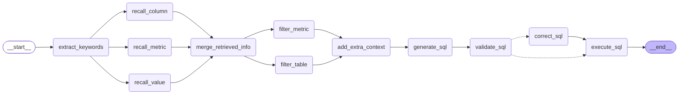

# 问数智能体

## 1. 需求说明

本章旨在实现问数智能体的工作流，工作流的编排以及各节点的职责。另外，为保证将来前端有一个较好的用户体验，工作流需要实时的输出执行进度和查询结果。

## 2. 代码组织规划

问数智能体的核心代码主要位于 data-agent/app/agent 目录下。

在智能体执行过程中，部分节点需要访问元数据或向量/检索系统以获取辅助信息，相关的查询与访问逻辑统一封装在 data-agent/app/repositories 目录中，供各个 Agent 节点按需调用。

除代码逻辑外，智能体运行还高度依赖提示词（Prompt）。所有提示词均集中管理在data-agent/prompts目录下。具体组织规划如下：

```bash
data-agent/
├─ app/
│  ├─ agent/
│  │  ├─ graph.py # 负责定义langgraph图
│  │  ├─ state.py # 负责定义langgraph状态
│  │  ├─ context.py # 负责定义langgraph运行上下文
│  │  ├─ llm.py # 负责定义llm
│  │  └─ nodes/
│  │     ├─ extract_keywords.py # 负责定义关键词抽取的节点
│  │     ├─ recall_column.py # 负责定义召回字段信息的节点
│  │     ├─ recall_metric.py # 负责定义召回指标信息的节点
│  │     ├─ recall_value.py  # 负责定义召回字段取值的节点
│  │     ├─ merge_retrieved_info.py # 负责定义合并召回信息的节点
│  │     ├─ filter_metric.py # 负责定义过滤指标信息的节点
│  │     ├─ filter_table.py # 负责定义过滤表格信息的节点
│  │     ├─ add_extra_context.py # 负责定义添加额外上下文信息的节点
│  │     ├─ generate_sql.py # 负责定义生成SQL的节点
│  │     ├─ validate_sql.py # 负责定义校验SQL的节点
│  │     ├─ correct_sql.py # 负责定义校正SQL的节点
│  │     └─ execute_sql.py # 负责定义执行SQL的节点
│  │
│  ├─ prompt/
│  │  └─ prompt_loader.py
│  │
│  └─ repositories/
│     ├─ mysql/
│     │  ├─ meta_mysql_repository.py
│     │  └─ dw_mysql_repository.py
│     ├─ qdrant/
│     │  ├─ column_qdrant_repository.py
│     │  └─ metric_qdrant_repository.py
│     └─ es/
│        └─ value_qdrant_repository.py
│
├─ prompt/
│  ├─ extend_keywords_for_column_recall.prompt # 为召回字段信息扩展关键词 的提示词
│  ├─ extend_keywords_for_metric_recall.prompt # 为召回指标信息扩展关键词 的提示词
│  ├─ extend_keywords_for_value_recall.prompt # 为召回字段取值扩展关键词 的提示词 
│  ├─ filter_metric_info.prompt # 过滤指标信息 的提示词
│  ├─ filter_table_info.prompt # 过滤表格信息 的提示词
│  ├─ generate_sql.prompt # 生成SQL 的提示词
│  └─ correct_sql.prompt # 校正SQL 的提示词


```

### 2.1. 节点参数

智能体的结构构建以[langgraph](https://docs.langchain.com/oss/python/langgraph/graph-api#nodes)为基础框架，完成结构清晰的项目构建.

在 LangGraph 中，节点是 Python 函数（同步函数或异步函数），它们接受以下参数：

1. `state`：在图中的各个节点流转的可变状态数据，类型在创建StateGraph对象时指定，初始值在执行图时指定

2. `config`：RunnableConfig类型，可以包含配置信息（例如：`thread_id`），在执行图时指定配置

3. `runtime`：Runtime类型，主要包含：context对象、stream_writer函数和store对象

   ​	1) `context对象`：静态上下文，包含n个固定依赖项，类型在创建StateGraph对象时指定，值在执行图时指定

   ​	2) `stream_writer函数`：用于写入自定义数据流的函数

   ​	3) `store对象`：用于实现跨会话长期记忆的对象


基本结构如下：

~~~bash
data-agent/
├─ app/
    ├─ agent/
         ├─ graph.py # 负责定义langgraph图
         ├─ state.py # 负责定义langgraph状态
         ├─ context.py # 负责定义langgraph运行上下文
         ├─ llm.py # 负责定义llm
         └─ nodes/
            ├─ extract_keywords.py # 负责定义关键词抽取的节点
            ├─ recall_column.py # 负责定义召回字段信息的节点
            ├─ recall_metric.py # 负责定义召回指标信息的节点
            ├─ recall_value.py  # 负责定义召回字段取值的节点
            ├─ merge_retrieved_info.py # 负责定义合并召回信息的节点
            ├─ filter_metric.py # 负责定义过滤指标信息的节点
            ├─ filter_table.py # 负责定义过滤表格信息的节点
            ├─ add_extra_context.py # 负责定义添加额外上下文信息的节点
            ├─ generate_sql.py # 负责定义生成SQL的节点
            ├─ validate_sql.py # 负责定义校验SQL的节点
            ├─ correct_sql.py # 负责定义校正SQL的节点
            └─ execute_sql.py # 负责定义执行SQL的节点
~~~

### 2.2. Graph的Context和State的类型

定义Context类型模块

创建`data-agent/app/agent/context.py`

~~~python
class DataAgentContext(TypedDict):
    pass


~~~

定义State类型模块

`data-agent/app/agent/state.py`

~~~python
class DataAgentState(TypedDict):
    pass
~~~

### 2.3. Graph的节点定义

定义extract_keywords.py模块

​		负责定义关键词抽取的节点

定义`data-agent/app/agent/node/extract_keywords.py`模块

~~~python
from langgraph.runtime import Runtime

from app.agent.context import DataAgentContext
from app.agent.state import DataAgentState
from app.core.log import logger

"""
利用Jiaba对提问进行一个基本非语义分词，可能会丢失语义的词，需要后面的节点对提问进行语义分词补充
"""
def extract_keywords(state: DataAgentState, runtime: Runtime[DataAgentContext]):
    runtime.stream_writer({"stage": "提取关键字"})

    try:
       	
        return {}
    except Exception as e:
        logger.error(f"抽取关键字失败：{str(e)}")
        raise
~~~

定义recall_column.py模块

​		负责定义召回字段信息的节点

定义`data-agent/app/agent/node/recall_column.py`模块

~~~python
from langgraph.runtime import Runtime

from app.agent.context import DataAgentContext
from app.agent.state import DataAgentState
from app.core.log import logger

async def recall_column(state: DataAgentState, runtime: Runtime[DataAgentContext]):
    runtime.stream_writer({"stage": "召回字段"})

    try:
        
        return {}
    except Exception as e:
        logger.error(f"召回字段失败：{str(e)}")
        raise
~~~


定义recall_metric.py模块

​		负责定义召回指标信息的节点

定义`data-agent/app/agent/node/recall_metric.py`模块

~~~python
from langgraph.runtime import Runtime

from app.agent.context import DataAgentContext
from app.agent.state import DataAgentState
from app.core.log import logger

async def recall_metric(state: DataAgentState, runtime: Runtime[DataAgentContext]):
    runtime.stream_writer({"stage": "召回指标"})

    try:
        
        return {}
    except Exception as e:
        logger.error(f"召回指标失败：{str(e)}")
        raise
~~~

定义recall_value.py模块

​		负责定义召回取值信息的节点

定义`data-agent/app/agent/node/recall_value.py`模块

~~~python
from langgraph.runtime import Runtime

from app.agent.context import DataAgentContext
from app.agent.state import DataAgentState
from app.core.log import logger

async def recall_value(state: DataAgentState, runtime: Runtime[DataAgentContext]):
    runtime.stream_writer({"stage": "召回字段取值"})

    try:
        
        return {}
    except Exception as e:
        logger.error(f"召回字段取值失败：{str(e)}")
        raise
~~~

定义merge_retrieved_info.py模块

​		负责定义合并召回信息的节点

定义`data-agent/app/agent/node/merge_retrieved_info.py`模块

~~~python
from langgraph.runtime import Runtime

from app.agent.context import DataAgentContext
from app.agent.state import DataAgentState
from app.core.log import logger

async def merge_retrieved_info(state: DataAgentState, runtime: Runtime[DataAgentContext]):
    runtime.stream_writer({"stage": "合并召回"})

    try:
        
        return {}
    except Exception as e:
        logger.error(f"合并召回失败：{str(e)}")
        raise
~~~

定义filter_metric.py模块

​		负责定义过滤指标信息的节点

定义`data-agent/app/agent/node/filter_metric.py`模块

~~~python
from langgraph.runtime import Runtime

from app.agent.context import DataAgentContext
from app.agent.state import DataAgentState
from app.core.log import logger

async def filter_metric(state: DataAgentState, runtime: Runtime[DataAgentContext]):
    runtime.stream_writer({"stage": "过滤指标"})

    try:
        
        return {}
    except Exception as e:
        logger.error(f"过滤指标失败：{str(e)}")
        raise
~~~

定义filter_table.py模块

​		负责定义过滤表信息的节点

定义`data-agent/app/agent/node/filter_table.py`模块

~~~python
from langgraph.runtime import Runtime

from app.agent.context import DataAgentContext
from app.agent.state import DataAgentState
from app.core.log import logger

async def filter_table(state: DataAgentState, runtime: Runtime[DataAgentContext]):
    runtime.stream_writer({"stage": "过滤表和字段"})

    try:
        
        return {}
    except Exception as e:
        logger.error(f"过滤表和字段失败：{str(e)}")
        raise
~~~

定义add_extra_context.py模块

​		负责定义添加额外上下文信息的节点

定义`data-agent/app/agent/node/add_extra_context.py`模块

~~~python
from langgraph.runtime import Runtime

from app.agent.context import DataAgentContext
from app.agent.state import DataAgentState
from app.core.log import logger

async def add_extra_context(state: DataAgentState, runtime: Runtime[DataAgentContext]):
    runtime.stream_writer({"stage": "添加额外信息"})

    try:
        
        return {}
    except Exception as e:
        logger.error(f"添加额外信息失败：{str(e)}")
        raise
~~~


定义generate_sql.py模块

​		负责定义生成sql的节点

定义`data-agent/app/agent/node/generate_sql.py`模块

~~~python
from langgraph.runtime import Runtime

from app.agent.context import DataAgentContext
from app.agent.state import DataAgentState
from app.core.log import logger

async def generate_sql(state: DataAgentState, runtime: Runtime[DataAgentContext]):
    runtime.stream_writer({"stage": "生成SQL"})

    try:
        
        return {}
    except Exception as e:
        logger.error(f"生成SQL失败：{str(e)}")
        raise
~~~


定义validate_sql.py.py模块

​		负责校验生成sql的节点

定义`data-agent/app/agent/node/validate_sql.py.py`模块

~~~python
from langgraph.runtime import Runtime

from app.agent.context import DataAgentContext
from app.agent.state import DataAgentState
from app.core.log import logger

async def validate_sql(state: DataAgentState, runtime: Runtime[DataAgentContext]):
    runtime.stream_writer({"stage": "校验SQL"})

    try:
        
        return {}
    except Exception as e:
        logger.error(f"校验SQL失败：{str(e)}")
        raise
~~~


定义correct_sql.py模块

​		负责定义校正sql信息的节点

定义`data-agent/app/agent/node/correct_sql.py`模块

~~~python
from langgraph.runtime import Runtime

from app.agent.context import DataAgentContext
from app.agent.state import DataAgentState
from app.core.log import logger

async def correct_sql(state: DataAgentState, runtime: Runtime[DataAgentContext]):
    runtime.stream_writer({"stage": "校正SQL"})

    try:
        
        return {}
    except Exception as e:
        logger.error(f"校正SQL失败：{str(e)}")
        raise
~~~


定义execute_sql.py模块

​		负责定义执行sql信息的节点

定义`data-agent/app/agent/node/execute_sql.py`模块

~~~python
from langgraph.runtime import Runtime

from app.agent.context import DataAgentContext
from app.agent.state import DataAgentState
from app.core.log import logger

async def execute_sql(state: DataAgentState, runtime: Runtime[DataAgentContext]):
    runtime.stream_writer({"stage": "执行SQL"})

    try:
        
        return {}
    except Exception as e:
        logger.error(f"召回字段失败：{str(e)}")
        raise
~~~

### 2.4. Graph结构图形组装

创建`data-agent/app/agent/graph.py`

参考：


**重点说明一：条件分支流转**

​    `add_conditional_edges(start,condition,conditional_edge_mapping)` 是 LangGraph 中构建 “条件分支流转” 的核心函数，

参数start：类型为`str`从哪一个节点开始判断分支

参数condition：类型为`Callable[[State], str]`条件判断函数（入参是图的 State，返回值是目标节点名称

参数conditional_edge_mapping：类型为`dict[str, str]`分支映射表：key = condition 函数的返回值，value = 目标节点名称

例如：

~~~python

state_graph.add_conditional_edges(
    "validata_sql",
    lambda state:"execute_sql" if state["error"] is None else "correct_sql",		       				
    {"execute_sql":"execute_sql","correct_sql":"correct_sql"}
)

~~~

开发判断分支： "validata_sql",

条件判断函数：lambda state:"execute_sql" if state["error"] is None else "correct_sql",

结果映射的分支：{"execute_sql":"execute_sql","correct_sql":"correct_sql"})

简单理解就是：在validata_sql节点开始判断分支，如果validata_sql出后，结果state中error变量还是默认值None，说明sql没有异常，判断函数返回execute_sql，执行分支execute_sql节点，如果结果state中error变量有异常，判断函数返回correct_sql，执行correct_sql节点。


具体实现：

（1）异常参数定义：

~~~python
class DataAgentState(TypedDict):
    error: str  # 错误信息，根据state中是否存在错误信息，可以进行流程执行
~~~

（2）节点异常实现：

~~~python
   try:
        # 执行验证sql
        # 模拟异常测试流程
        i=1/0 
        # 无异常 None
        logger.info(f"sql验证正确：{sql}")
        return {"error":None}
    except Exception as e:
        logger.info(f"sql验证失败：{sql}")
        return {"error":str(e)}
~~~


**重点说明二：查看图构建的形状**

查看图构建的形状 draw_mermaid-->文本画图的方式

```python
print(graph.get_graph().draw_mermaid())
```

生成图如下：


[LangGraph图的构建](https://reference.langchain.com/python/langgraph)

~~~python
# 构建图
state_graph=StateGraph(state_schema=DataAgentState,context_schema=DataAgentContext)

# 添加节点
state_graph.add_node("extract_keywords",extract_keywords)
state_graph.add_node("recall_column",recall_column)
state_graph.add_node("recall_value",recall_value)
state_graph.add_node("recall_metric",recall_metric)
state_graph.add_node("merge_retrieved_info",merge_retrieved_info)
state_graph.add_node("filter_table",filter_table)
state_graph.add_node("filter_metric",filter_metric)
state_graph.add_node("add_extra_context",add_extra_context)
state_graph.add_node("generate_sql",generate_sql)
state_graph.add_node("validata_sql",validate_sql)
state_graph.add_node("correct_sql",correct_sql)
state_graph.add_node("execute_sql",execute_sql)

# 添加关系
state_graph.add_edge(START,"extract_keywords")
state_graph.add_edge("extract_keywords","recall_column")
state_graph.add_edge("extract_keywords","recall_value")
state_graph.add_edge("extract_keywords","recall_metric")
state_graph.add_edge("recall_column","merge_retrieved_info")
state_graph.add_edge("recall_value","merge_retrieved_info")
state_graph.add_edge("recall_metric","merge_retrieved_info")
state_graph.add_edge("merge_retrieved_info","filter_table")
state_graph.add_edge("merge_retrieved_info","filter_metric")
state_graph.add_edge("filter_table","add_extra_context")
state_graph.add_edge("filter_metric","add_extra_context")
state_graph.add_edge("add_extra_context","generate_sql")
state_graph.add_edge("generate_sql","validata_sql")
# 添加带条件的边
state_graph.add_conditional_edges("validata_sql",lambda state:"execute_sql" if state["error"] is None else "correct_sql",{"execute_sql":"execute_sql","correct_sql":"correct_sql"})

state_graph.add_edge("correct_sql","execute_sql")
state_graph.add_edge("execute_sql",END)


# 编译图--获取全局graph对象
compiled_graph=state_graph.compile()

# 查看图构建的形状 draw_mermaid-->文本画图的方式
# print(compiled_graph.get_graph().draw_mermaid())

~~~

~~~mermaid

graph TD;
	__start__([<p>__start__</p>]):::first
	extract_keywords(extract_keywords)
	recall_column(recall_column)
	recall_metric(recall_metric)
	recall_value(recall_value)
	merge_retrieved_info(merge_retrieved_info)
	filter_metric(filter_metric)
	filter_table(filter_table)
	add_extra_context(add_extra_context)
	generate_sql(generate_sql)
	validate_sql(validate_sql)
	correct_sql(correct_sql)
	execute_sql(execute_sql)
	__end__([<p>__end__</p>]):::last
	__start__ --> extract_keywords;
	add_extra_context --> generate_sql;
	correct_sql --> execute_sql;
	extract_keywords --> recall_column;
	extract_keywords --> recall_metric;
	extract_keywords --> recall_value;
	filter_metric --> add_extra_context;
	filter_table --> add_extra_context;
	generate_sql --> validate_sql;
	merge_retrieved_info --> filter_metric;
	merge_retrieved_info --> filter_table;
	recall_column --> merge_retrieved_info;
	recall_metric --> merge_retrieved_info;
	recall_value --> merge_retrieved_info;
	validate_sql -.-> correct_sql;
	validate_sql -.-> execute_sql;
	execute_sql --> __end__;
	classDef default fill:#f2f0ff,line-height:1.2
	classDef first fill-opacity:0
	classDef last fill:#bfb6fc
~~~





### 2.5. Graph流式调用输出

复杂的图构建过程中，存在很多耗时的阶段，在用户提问后，会出现阻塞等待的情况，为提高前端的用户体验，图最终选择流式调用，实现实时流式输出，LangGraph 实现了一个流处理系统，以呈现实时更新。流处理对于提升基于大语言模型（LLM）的应用程序的响应能力至关重要。通过逐步显示输出，即使在完整响应准备好之前，流处理也能显著改善用户体验（UX），尤其是在应对大语言模型的延迟时。

工作流的流式输出可参考[langgraph](https://docs.langchain.com/oss/python/langgraph/streaming)官网

LangGraph 流式输出支持以下能力：

- 流式输出图状态：以 “更新模式” 和 “值模式” 获取状态更新与状态值。
- 流式输出子图结果：同时输出父图与嵌套子图的执行结果。
- 流式输出大模型 Token：捕获来自节点、子图或工具内部的 Token 流。
- 流式输出自定义数据：直接从工具函数发送自定义更新或进度信号。
- 支持多种流式模式：可选择值模式（完整状态）、更新模式（状态增量）、消息模式（LLM Token + 元数据）、自定义模式（任意用户数据）或调试模式（详细追踪）。

流式输出的[基本使用](https://docs.langchain.com/oss/python/langgraph/streaming#basic-usage-example)

~~~python
for chunk in graph.stream(inputs, stream_mode="updates"):
    print(chunk)
~~~

参数一：作为图执行的初始状态，是流式输出的 “数据源基础”，state中定义用于输出的某个参数

参数二：流式输出的模式指定，可以如下选择

~~~
values :在图的每一步之后流式传输状态的完整值。
updates: 在图的每一步之后流式传输状态更新
custom:  从您的图节点内部流式传输自定义数据  stream_writer
~~~


项目中流式输出的最终实现：

掌柜问数流式输出选择：[流式输出自定义数据](https://docs.langchain.com/oss/python/langgraph/streaming#stream-custom-data)

~~~python
# 调用图流式输出
async for chunk in graph.astream(input=state,context=context,stream_mode="custom"):
      print(chunk)
~~~

节点中输出内容：获取流式输出器

~~~python
runtime.stream_writer({"stage": "抽取关键字"})
~~~

最终各节点实现：

~~~python
runtime.stream_writer({"stage": "抽取关键字"})
runtime.stream_writer({"stage": "召回字段信息"})
runtime.stream_writer({"stage": "召回指标信息"})
runtime.stream_writer({"stage": "召回字段值信息"})
runtime.stream_writer({"stage": "合并召回信息"})
runtime.stream_writer({"stage": "过滤指标信息"})
runtime.stream_writer({"stage": "过滤表信息"})
runtime.stream_writer({"stage": "添加额外上下文"})
runtime.stream_writer({"stage": "生成sql语句"})
runtime.stream_writer({"stage": "验证sql语句"})
runtime.stream_writer({"stage": "校正sql语句"})
runtime.stream_writer({"stage": "执行sql语句"})
~~~

执行图异步函数实现：

~~~python
# 测试流式调用
if __name__ == '__main__':
    async def test():
        # 创建上下文对象
        context= DataAgentContext( )
        # 创建状态对象
        state = DataAgentState()
        # 调用图流式输出
        async for chunk in graph.astream(input=state,context=context,stream_mode="custom"):
            print('---', chunk)
    # 调用测试函数
    asyncio.run(test())
~~~


## 3. 具体实现

### 3.1. prompts

#### 3.1.1. 提示词

提示词可从课程资料获取，此处不再展示。

#### 3.1.2. 提示词加载

在`data-agent/app/prompt/prompt_loader.py`中编写如下代码，用于加载提示词：

```python
from pathlib import Path

def load_prompt(name:str):
    # 定义路径
    prmpt_file =Path(__file__).parents[2]/"prompts"/f"{name}.prompt"
    # 读取数据
    return prmpt_file.read_text(encoding="utf_8")


if __name__ == '__main__':
    print(load_prompt("extend_keywords_for_column_recall"))

```

### 3.2. llm

在`data-agent/app/agent/llm.py`中编写如下代码，用于定义llm：

[langchain](https://docs.langchain.com/oss/python/langchain/models#initialize-a-model)模型初始化实现

```python
import os

from langchain.chat_models import init_chat_model

from app.conf.app_config import app_config

llm = init_chat_model(
    model=app_config.llm.model_name,
    api_key= app_config.llm.api_key,
    # base_url="",
    temperature=0 # 让大型处理的结果稳定，不要创意
)

# llm = init_chat_model(
#     model="qwen3.7-plus",
#     model_provider="openai",
#     api_key= os.getenv("DASHSCOPE_API_KEY"),
#     base_url=os.getenv("DASHSCOPE_BASE_URL"),
#
#     temperature=0 # 让大型处理的结果稳定，不要创意
# )

if __name__ == '__main__':
    for chunk in llm.stream("你是什么模型？"):
        print(chunk.text, end="", flush=True)

```

### 3.3. state

在`data-agent/app/agent/state.py`中编写如下代码，用于定义智能体状态：

```python
from typing import TypedDict

from app.models.es.value_info_es import ValueInfoES
from app.models.qdrant.column_info_qdrant import ColumnInfoQdrant
from app.models.qdrant.metric_info_qdrant import MetricInfoQdrant


# 列信息封装实体
class ColumnInfoState(TypedDict):
    name: str
    type: str
    role: str
    examples: list
    description: str
    alias: list[str]

# 表信息封装实体
class TableInfoState(TypedDict):
    name: str
    role: str
    description: str
    columns: list[ColumnInfoState]


# 指标信息封装实体
class MetricInfoState(TypedDict):
    name: str
    description: str
    relevant_columns: list[str]
    alias: list[str]

# 日期时间信息封装实体
class DateInfoState(TypedDict):
    date: str
    weekday: str
    quarter: str

# 数据库环境信息封装实体
class DBInfoState(TypedDict):
    version: str
    dialect: str

# Agent总结状态封装实体
class DataAgentState(TypedDict):
    query: str # 用户的查询
    keywords: list[str] # 提取关键字列表
    recall_columns: list[ColumnInfoQdrant] # 召回列信息列表
    recall_metric: list[MetricInfoQdrant] # 召回指标信息列表
    recall_values: list[ValueInfoES] # 召回值信息列表
    table_infos: list[TableInfoState] # 表信息列表
    metric_infos: list[MetricInfoState] # 指标信息列表
    date_info: DateInfoState # 日期时间信息
    db_info: DBInfoState # 数据库环境信息
    sql: str # 生成的SQL
    error: str # 错误信息,根据state中是否存在错误信息，可以进行流程执行

```

### 3.4. context

在`data-agent/app/agent/context.py`中编写如下代码，用于定义智能体运行时所需的上下文依赖：

```python
from typing import TypedDict
from langchain_huggingface import HuggingFaceEndpointEmbeddings
from app.repositories.es.value_es_repository import ValueESRepository
from app.repositories.mysql.dw_mysql_repository import DWMysqlRepository
from app.repositories.mysql.meta_mysql_repository import MetaMysqlRepository
from app.repositories.qdrant.column_qdrant_repository import ColumnQdrantRepository
from app.repositories.qdrant.metric_qdrant_repository import MetricQdrantRepository


class DataAgentContext(TypedDict):
    """Agent的上下文封装"""
    embedding_client: HuggingFaceEndpointEmbeddings # 向量服务器客户端
    column_qdrant_repository: ColumnQdrantRepository # 字段向量库
    metric_qdrant_repository: MetricQdrantRepository # 指标向量库
    value_es_repository: ValueESRepository # 字段值全文索引库
    meta_mysql_repository: MetaMysqlRepository # 元数据库
    dw_mysql_repository: DWMysqlRepository # 数据仓库

```

### 3.5. nodes

#### 3.5.1. extract_keywords

本节点主要实现关键字提取，就是根据用户提供的问题，使用jieba提取问题所属的关键字，供后续节点召回与问题相关的字段，指标，列值使用

分词工具：[jieba](https://github.com/fxsjy/jieba)

选择基于 [TF-IDF 算法](https://github.com/fxsjy/jieba?tab=readme-ov-file#%E5%9F%BA%E4%BA%8E-tf-idf-%E7%AE%97%E6%B3%95%E7%9A%84%E5%85%B3%E9%94%AE%E8%AF%8D%E6%8A%BD%E5%8F%96)的关键词抽取方式

基于经典的**TF-IDF（词频 - 逆文档频率）** 算法：

- TF（词频）：衡量词在当前文本中出现的频率，频率越高越可能是关键词；
- IDF（逆文档频率）：衡量词在整个语料库中的稀缺性，越稀缺（仅在少数文本出现）的词，区分度越高，权重越大。
- 实现逻辑：

~~~
TF逻辑：如果一个词在文章中反复出现，它很可能与文章的主题高度相关。
IDF逻辑：如果一个词在所有文档中都频繁出现（如“的”、“是”、“the”），那么它对于区分特定文档的价值就很低。IDF 会调低这类常见词的权重，提升稀有词的权重。
~~~

jieba 对该算法做了中文适配：结合中文分词特性，先对文本分词，再计算每个词的 TF-IDF 权重，最终按权重排序抽取关键词。

**适用场景**

​		jieba TF-IDF 关键词抽取的核心是结合词频和语料稀缺性，适配中文分词，支持词性过滤，轻量高效但缺乏语义理解；

​		能快速提取通用文本的核心关键词，满足中小规模、通用场景的业务需求，结合兜底逻辑可适配短文本（如用户查询）场景。

**使用方式**：

jieba.analyse.extract_tags(sentence, topK=20, withWeight=False, allowPOS=())

- sentence 为待提取的文本
- topK 为返回几个 TF/IDF 权重最大的关键词，默认值为 20
- withWeight 为是否一并返回关键词权重值，默认值为 False
- allowPOS 仅包括指定词性的词，默认值为空，即不筛选

**参数指定词性**：allowPOS 

paddle模式词性和专名类别标签集合如下表，其中词性标签 24 个（小写字母）专名类别标签 4 个（大写字母）。

| 标签 | 含义     | 标签 | 含义     | 标签 | 含义     | 标签 | 含义     |
| ---- | -------- | ---- | -------- | ---- | -------- | ---- | -------- |
| n    | 普通名词 | f    | 方位名词 | s    | 处所名词 | t    | 时间     |
| nr   | 人名     | ns   | 地名     | nt   | 机构名   | nw   | 作品名   |
| nz   | 其他专名 | v    | 普通动词 | vd   | 动副词   | vn   | 名动词   |
| a    | 形容词   | ad   | 副形词   | an   | 名形词   | d    | 副词     |
| m    | 数量词   | q    | 量词     | r    | 代词     | p    | 介词     |
| c    | 连词     | u    | 助词     | xc   | 其他虚词 | w    | 标点符号 |
| PER  | 人名     | LOC  | 地名     | ORG  | 机构名   | TIME | 时间     |

~~~python
       # 定义返回指定词性的元组
        allow_pos = (
            "n",  # 名词: 数据、服务器、表格
            "nr",  # 人名: 张三、李四
            "ns",  # 地名: 北京、上海
            "nt",  # 机构团体名: 政府、学校、某公司
            "nz",  # 其他专有名词: Unicode、哈希算法、诺贝尔奖
            "v",  # 动词: 运行、开发
            "vn",  # 名动词: 工作、研究
            "a",  # 形容词: 美丽、快速
            "an",  # 名形词: 难度、合法性、复杂度
            "eng",  # 英文
            "i",  # 成语
            "l",  # 常用固定短语
         )
         # 使用jieba从用户的查询信息中提取关键，基于TF-IDF算法实现   
         keywords:list[str]=jieba.analyse.extract_tags(query,allowPOS=allow_pos)     
~~~


在`data-agent/app/agent/nodes/extract_keywords.py`中编写如下代码：

```python
from jieba.analyse import extract_tags
from langgraph.runtime import Runtime

from app.agent.context import DataAgentContext
from app.agent.state import DataAgentState
from app.core.log import logger

"""
利用Jiaba对提问进行一个基本非语义分词，可能会丢失语义的词，需要后面的节点对提问进行语义分词补充
"""
def extract_keywords(state: DataAgentState, runtime: Runtime[DataAgentContext])->dict:
    runtime.stream_writer({"stage": "提取关键字"})

    try:
        # 得到提问
        query = state["query"]

        # 使用jiaba进行分词
        # 定义返回指定词性的元组
        allow_pos = (
            "n",  # 名词: 数据、服务器、表格
            "nr",  # 人名: 张三、李四
            "ns",  # 地名: 北京、上海
            "nt",  # 机构团体名: 政府、学校、某公司
            "nz",  # 其他专有名词: Unicode、哈希算法、诺贝尔奖
            "v",  # 动词: 运行、开发
            "vn",  # 名动词: 工作、研究
            "a",  # 形容词: 美丽、快速
            "an",  # 名形词: 难度、合法性、复杂度
            "eng",  # 英文
            "i",  # 成语
            "l",  # 常用固定短语
        )
        result = extract_tags(query, topK=10, allowPOS=allow_pos)
        logger.info(f"提取的关键字为：{result}")
        # 将原始的提问也加入keys中  要利用set去重，防止query就在resuLt中
        keyswords = list(set(result + [query]))

        logger.info(f"抽取关键字完成：{keyswords}")

        return {"keywords": keyswords}
    except Exception as e:
        logger.error(f"抽取关键字失败：{str(e)}")
        raise
```

`data-agent/app/agent/state.py`

增加属性query,用于接收用户提交的问题

~~~python
class DataAgentState(TypedDict):
    query: str  # 用户的查询
    keywords: list[str]  # 提取关键字列表
~~~

`data-agent/app/agent/graph.py`

Graph的状态对象中添加问题query

~~~python
# 创建状态对象
state = DataAgentState(query="2025年各地区销售总额")
~~~


#### 3.5.2. recall_column

本节点的主要任务召回列信息,根据上个阶段抽取的关键字列表，实现列信息在Qdrant中的查询召回

主要思路：

​        1.使用[LLM](https://docs.langchain.com/oss/python/langchain/models#initialize-a-model)扩展关键词

​				大模型能识别同义词、近义词、行业术语变体，避免因表述不同导致的信息遗漏：

​        2.使用扩展后的关键词召回字段信息

​		

在`data-agent/app/agent/nodes/recall_column.py`中编写如下代码：

```python
from langchain_core.output_parsers import JsonOutputParser
from langchain_core.prompts import PromptTemplate
from langgraph.runtime import Runtime

from app.agent.context import DataAgentContext
from app.agent.llm import llm
from app.agent.state import DataAgentState
from app.core.log import logger
from app.models.qdrant.column_info_qdrant import ColumnInfoQdrant
from app.prompt.prompt_loader import load_prompt

"""
0. 对query进行大模型语义化的分词，并与jiaba分词合并
1. 拿各个分词去做召回
2. 去查询qdrant向量库
3. 得到字段信息列表： list[ColumnInfoQdrant]
4. 返回字段信息列表： list[ColumnInfoQdrant]
"""
async def recall_column(state: DataAgentState, runtime: Runtime[DataAgentContext]):
    runtime.stream_writer({"stage": "召回字段"})

    try:
        query = state["query"]
        keywords = state["keywords"]
        embedding_client = runtime.context["embedding_client"]
        column_qdrant_repository = runtime.context["column_qdrant_repo"]

        # 0.对query进行大模型语义化的分词，并与jiaba分词合并

        prompt_template = PromptTemplate(
            template=load_prompt("extend_keywords_for_column_recall"),
            input_variables=["query"],
        )
        output_parser = JsonOutputParser()
        chain = prompt_template | llm | output_parser
        result = await chain.ainvoke({"query": query})
        logger.info(f"recall_column llm keywords: {result}")
        keywords = list(set(keywords + result))

        # 用来保存所有召回的字段信息对象，需要去重：key: column_id
        column_infos_dict: dict[str, ColumnInfoQdrant] = {}
        # 1.# 拿各个分词去做召回
        for keyword in keywords:
            # 将keyword转换为向量
            vector = await embedding_client.aembed_query(keyword)
            # 2.去查询qdrant向量库, 得到字段信息列表： list[ColumnInfoQdrant]
            column_infos: list[ColumnInfoQdrant] = await column_qdrant_repository.search(vector)
            # 对查询得到的列表数据进行去重保存
            for column_info in column_infos:
                column_id = column_info["id"]
                if column_id not in column_infos_dict:
                    column_infos_dict[column_id] = column_info
        # 生成目标数据结构
        recall_columns: list[ColumnInfoQdrant] = list(column_infos_dict.values())

        logger.info(f"召回字段完成：{recall_columns}")
        # 3.# 返回字段信息列表： list[ColumnInfoQdrant]
        return {"recall_columns": recall_columns}
    except Exception as e:
        logger.error(f"召回字段失败：{str(e)}")
        raise
```

在`data-agent/app/repositories/qdrant/column_qdrant_repository.py`中添加如下方法：

```python
    async def search(self, vector: list[float], score_threshold=0.6) -> list[ColumnInfoQdrant]:
        result = await self.client.query_points(
            collection_name=self.collection_name,
            query=vector,
            score_threshold=score_threshold,  # 匹配相似度的临界值，小于这个值的所有点忽略
        )

        # print(result.points)
        # print(len(result.points[0].payload))
        # return [point.payload for point in result.points]  # payload是纯字典
        return [ColumnInfoQdrant(**point.payload) for point in result.points]
```


`data-agent/app/agent/state.py`

增加recall_columns属性,用于接收字段召回信息

~~~python
class DataAgentState(TypedDict):
    query: str  # 用户的查询
    keywords: list[str]  # 提取关键字列表
    recall_columns: list[ColumnInfoQdrant]  # 召回列信息列表
~~~

在`data-agent/app/agent/context.py`中编写如下代码，添加字段召回时所需的上下文依赖：

```python
from typing import TypedDict
from langchain_huggingface import HuggingFaceEndpointEmbeddings
from app.repository.qdrant.column_qdrant_repository import ColumnQdrantRepository

class DataAgentContext(TypedDict):
    embedding_client:HuggingFaceEndpointEmbeddings # 向量服务器客户端
    column_qdrant_repo:ColumnQdrantRepository # 字段向量库

```


#### 3.5.3. recall_metric

**1）**在data-agent/app/agent/nodes/recall_metric.py中编写如下代码：

本节点的主要任务召回指标信息,根据上个阶段抽取的关键字列表，实现列信息在Qdrant中的查询召回

```python
from langchain_core.output_parsers import JsonOutputParser
from langchain_core.prompts import PromptTemplate
from langgraph.runtime import Runtime

from app.agent.context import DataAgentContext
from app.agent.llm import llm
from app.agent.state import DataAgentState
from app.core.log import logger
from app.models.qdrant.metric_info_qdrant import MetricInfoQdrant
from app.prompt.prompt_loader import load_prompt

"""
0. 对query进行大模型语义化的分词，并与jiaba分词合并
1. 拿各个分词去做召回
2. 去查询qdrant向量索引库
3. 得到指标信息列表： list[MetricInfoQdrant]
4. 返回指标信息列表： list[MetricInfoQdrant]
"""
async def recall_metric(state: DataAgentState, runtime: Runtime[DataAgentContext]):
    runtime.stream_writer({"stage": "召回指标"})

    try:
        query = state["query"]
        keywords = state["keywords"]
        embedding_client = runtime.context["embedding_client"]
        metric_qdrant_repo = runtime.context["metric_qdrant_repo"]

        # 0.对query进行大模型语义化的分词，并与jiaba分词合并
        prompt_template = PromptTemplate(
            template=load_prompt("extend_keywords_for_metric_recall"),
            input_variables=["query"],
        )
        output_parser = JsonOutputParser()
        chain = prompt_template | llm | output_parser
        result = await chain.ainvoke({"query": query})
        logger.info(f"recall_metric llm keywords: {result}")
        keywords = list(set(keywords + result))

        # 用来保存所有召回的字段信息对象，需要去重：key: metric_id
        metric_infos_dict: dict[str, MetricInfoQdrant] = {}
        # 1.# 拿各个分词去做召回
        for keyword in keywords:
            # 将keyword转换为向量
            vector = await embedding_client.aembed_query(keyword)
            # 2.去查询qdrant向量库, 得到字段信息列表： list[MetricInfoQdrant]
            metric_infos: list[MetricInfoQdrant] = await metric_qdrant_repo.search(vector)
            # 对查询得到的列表数据进行去重保存
            for metric_info in metric_infos:
                metric_id = metric_info["id"]
                if metric_id not in metric_infos_dict:
                    metric_infos_dict[metric_id] = metric_info
        # 3. 生成目标数据结构
        recall_metrics: list[MetricInfoQdrant] = list(metric_infos_dict.values())

        logger.info(f"召回指标完成：{recall_metrics}")
        # 4.# 返回指标信息列表： list[MetricInfoQdrant]
        return {"recall_metrics": recall_metrics}
    except Exception as e:
        logger.error(f"召回指标失败：{str(e)}")
        raise
```

**2）**在data-agent/app/repositories/qdrant/metric_qdrant_repository.py中添加如下方法：

```python
    async def search(self, vector: list[float], score_threshold=0.6) -> list[MetricInfoQdrant]:
        result = await self.client.query_points(
            collection_name=self.collection_name,
            query=vector,
            score_threshold=score_threshold,  # 匹配相似度的临界值，小于这个值的所有点忽略
        )

        # print(result.points)
        # print(len(result.points[0].payload))
        # return [point.payload for point in result.points]  # payload是纯字典
        return [MetricInfoQdrant(**point.payload) for point in result.points]
```

**3）**`data-agent/app/agent/state.py`

增加属性recall_metric,用于接收字段召回信息

~~~python
class DataAgentState(TypedDict):
    query: str # 用户的查询
    keywords: list[str] # 提取关键字列表
    recall_columns: list[ColumnInfoQdrant] # 召回列信息列表
    recall_metric: list[MetricInfoQdrant] # 召回指标信息列表
~~~

在`data-agent/app/agent/context.py`中编写如下代码，添加指标召回运行时所需的上下文依赖：

```python
from typing import TypedDict
from langchain_huggingface import HuggingFaceEndpointEmbeddings
from app.repository.qdrant.column_qdrant_repository import ColumnQdrantRepository
from app.repository.qdrant.metric_qdrant_repository import MetricQdrantRepository


class DataAgentContext(TypedDict):
    embedding_client:HuggingFaceEndpointEmbeddings # 向量服务器客户端
    column_qdrant_repo:ColumnQdrantRepository #字段向量库
    metric_qdrant_repo:MetricQdrantRepository # 指标向量库


```

#### 3.5.4. recall_value

**1）**在data-agent/app/agent/nodes/recall_value.py中编写如下代码：

本节点的主要任务召回字段取值信息,根据上个阶段抽取的关键字列表，实现列信息在ES中的查询召回

```python
from langchain_core.output_parsers import JsonOutputParser
from langchain_core.prompts import PromptTemplate
from langgraph.runtime import Runtime

from app.agent.context import DataAgentContext
from app.agent.llm import llm
from app.agent.state import DataAgentState
from app.core.log import logger
from app.models.es.value_info_es import ValueInfoES
from app.prompt.prompt_loader import load_prompt

"""
0. 对query进行大模型语义化的分词，并与jiaba分词合并
1. 拿各个分词去做召回
2. 去查询ES全文索引库
3. 得到字段信息列表： list[ValueInfoES]
4. 返回字段信息列表： list[ValueInfoES]
"""
async def recall_value(state: DataAgentState, runtime: Runtime[DataAgentContext]):
    runtime.stream_writer({"stage": "召回字段值"})

    try:
        query = state["query"]
        keywords = state["keywords"]
        value_es_repo = runtime.context["value_es_repo"]

        # 0.对query进行大模型语义化的分词，并与jiaba分词合并
        prompt_template = PromptTemplate(
            template=load_prompt("extend_keywords_for_value_recall"),
            input_variables=["query"],
        )
        output_parser = JsonOutputParser()
        chain = prompt_template | llm | output_parser
        result = await chain.ainvoke({"query": query})
        logger.info(f"recall_value llm keywords: {result}")
        keywords = list(set(keywords + result))

        # 用来保存所有召回的字段信息对象，需要去重：key: value_id
        value_infos_dict: dict[str, ValueInfoES] = {}
        # 1.# 拿各个分词去做召回
        for keyword in keywords:
            # 2.去查询ES库, 得到字段值信息列表： list[ValueInfoES]
            value_infos: list[ValueInfoES] = await value_es_repo.search(keyword)
            # 对查询得到的列表数据进行去重保存
            for value_info in value_infos:
                value_id = value_info["id"]
                if value_id not in value_infos_dict:
                    value_infos_dict[value_id] = value_info
        # 3. 生成目标数据结构
        recall_values: list[ValueInfoES] = list(value_infos_dict.values())

        logger.info(f"召回字段值完成：{recall_values}")
        # 4. 返回字段取值列表： list[valueInfoQdrant]
        return {"recall_values": recall_values}
    except Exception as e:
        logger.error(f"召回字段值失败：{e}")
        raise
```

**2）**在data-agent/app/repositories/es/value_es_repository.py中添加如下代码：

```python
    async def search(self, keyword:str)->list[ValueInfoES]:
        result = await self.client.search(
            index=self.index_name,
            query={
                "match": {
                    "value": keyword
                }
            },
        )
        # print(result)
        # print(result["hits"]["hits"][0]["_source"])

        # 读取文档数据并整理成目标结构返回
        return [ValueInfoES(**item["_source"]) for item in result["hits"]["hits"]]
```


**3）**`data-agent/app/agent/state.py`

增加属性recall_values,用于接收字段召回信息

~~~python
class DataAgentState(TypedDict):
    query: str # 用户的查询
    keywords: list[str] # 提取关键字列表
    recall_columns: list[ColumnInfoQdrant] # 召回列信息列表
    recall_metric: list[MetricInfoQdrant] # 召回指标信息列表
    recall_values: list[ValueInfoES] # 召回值信息列表
~~~

在`data-agent/app/agent/context.py`中编写如下代码，添加字段取值召回运行时所需的上下文依赖：

```python
from typing import TypedDict
from langchain_huggingface import HuggingFaceEndpointEmbeddings
from app.repository.es.value_es_repository import ValueESRepository
from app.repository.qdrant.column_qdrant_repository import ColumnQdrantRepository
from app.repository.qdrant.metric_qdrant_repository import MetricQdrantRepository


class DataAgentContext(TypedDict):
    embedding_client:HuggingFaceEndpointEmbeddings # 向量服务器客户端
    column_qdrant_repo:ColumnQdrantRepository #字段向量库
    value_es_repo:ValueESRepository # 字段值索引库
    metric_qdrant_repo:MetricQdrantRepository # 指标向量库

```


#### 3.5.5. merge_retrieved_info

本节点实现的合并召回信息，主要是针对之前节点的三路召回情况，进行一个汇总，其中包括 字段召回结果，指标召回结果 字段取值召回结果。

合并思路分析：合并后结果主要以提示词的方式提交给大模型，大模型基于合并后的结果生成sql语句

第一：用户的问题

第二：解决问题需要到的表

第三：解决问题需要用到的字段

第四：解决问题需要用到的字段取值

第五：解决问题需要用到的指标

封装如上信息的结构形态：表信息体现是一种结构化的信息展现：

可以选择： 1.json  2.yaml       yaml在结构体现上比json的表达更清晰明了，选择yaml格式封装


**1）**`data-agent/app/agent/state.py`

增加类型 ColumnInfoState 、TableInfoState和MetricInfoState，并在state中添加相应的属性

~~~python
# 列信息封装实体
class ColumnInfoState(TypedDict):
    name: str
    type: str
    role: str
    examples: list
    description: str
    alias: list[str]

# 表信息封装实体
class TableInfoState(TypedDict):
    name: str
    role: str
    description: str
    columns: list[ColumnInfoState]

# 指标信息封装实体
class MetricInfoState(TypedDict):
    name: str
    description: str
    relevant_columns: list[str]
    alias: list[str]
        
# 自定义State模型
class DataAgentState(TypedDict):
    query: str # 用户提问
    keywords: list[str] # 提问分词产生的多个关键字
    recall_columns: list[ColumnInfoQdrant] # 列信息对象列表
    recall_metrics: list[MetricInfoQdrant] # 指标信息对象列表
    recall_values: list[ValueInfoES] # 字段值信息对象列表
    table_infos: list[TableInfoState] # 合并3路召回产生的相关表及其字段信息状态列表
    metric_infos: list[MetricInfoState] # 指标信息状态对象列表
        
~~~


**2）**在data-agent/app/agent/nodes/merge_retrieved_info.py中编写如下代码：

```python
from langgraph.runtime import Runtime

from app.agent.context import DataAgentContext
from app.agent.state import DataAgentState, MetricInfoState, ColumnInfoState, TableInfoState
from app.core.log import logger
from app.models.es.value_info_es import ValueInfoES
from app.models.mysql.column_info_mysql import ColumnInfoMySQL
from app.models.mysql.table_info_mysql import TableInfoMySQL
from app.models.qdrant.column_info_qdrant import ColumnInfoQdrant
from app.models.qdrant.metric_info_qdrant import MetricInfoQdrant


async def merge_retrieved_info(state:DataAgentState, runtime: Runtime[DataAgentContext]):
    runtime.stream_writer({"stage": "合并召回"})
    try:
        # 取出相关的数据
        recall_columns: list[ColumnInfoQdrant] = state["recall_columns"]
        recall_metrics: list[MetricInfoQdrant] = state["recall_metrics"]
        recall_values: list[ValueInfoES] = state["recall_values"]
        meta_mysql_repo = runtime.context["meta_mysql_repo"]

        # 1. 收集最完整的字段信息列表

        # 1.1 根据recall_columns来创建
        column_infos_dict: dict[str, ColumnInfoQdrant] = {item["id"]: item for item in recall_columns}
        # 1.2 补充1：recall_metrics对应的字段
        for metric in recall_metrics:
            for relevant_column_id in metric["relevant_columns"]:
                if relevant_column_id not in column_infos_dict:
                    column_info_mysql: ColumnInfoMySQL = await meta_mysql_repo.get_colun_info_by_id(relevant_column_id)
                    column_infos_dict[relevant_column_id] = _convert_column_info_mysql_to_qdrant(column_info_mysql)
        # 1.3. 补充2： 字段值对应的字段  内部还需要将当前字段值添加到字段的examples中
        for recall_value in recall_values:
            column_id = recall_value["column_id"]
            if column_id not in column_infos_dict:
                column_info_mysql: ColumnInfoMySQL = await meta_mysql_repo.get_colun_info_by_id(column_id)
                column_infos_dict[column_id] = _convert_column_info_mysql_to_qdrant(column_info_mysql)
            if recall_value["value"] not in column_infos_dict[column_id]["examples"]:
                column_infos_dict[column_id]["examples"].append(recall_value["value"])

        # 对字段信息列表按表分组存储： dict[table_id, list[ColumnInfoQdrant]]
        table_column_infos_dict: dict[str, list[ColumnInfoQdrant]] = {}
        # column_infos_dict: dict[str, ColumnInfoQdrant]
        for column_info in column_infos_dict.values():
            if column_info["table_id"] not in table_column_infos_dict:
                table_column_infos_dict[column_info["table_id"]] = []
            table_column_infos_dict[column_info["table_id"]].append(column_info)

        table_infos: list[TableInfoState] = []

        # 补充3：将相关表的主键和外键字段添加到列表中
        for table_id, column_infos in table_column_infos_dict.items():
            # 去meta库取当前表的主键和外键字段
            pf_column_infos: list[ColumnInfoMySQL] = await meta_mysql_repo.get_column_infos_by_table_id(table_id)
            for pf_column_info in pf_column_infos:
                if pf_column_info.id not in column_infos_dict:
                    table_column_infos_dict[table_id].append(_convert_column_info_mysql_to_qdrant(pf_column_info))

            # 2. 生成TableInfoState的对象列表
            # 2.1 查询当前表信息
            table_info_mysql: TableInfoMySQL = await meta_mysql_repo.get_table_info_by_table_id(table_id)
            # 2.2 得到当前表的所字段状态信息对象列表
            columns: list[ColumnInfoState] = [_convert_column_info_qdrant_to_state(item) for item in column_infos]
            # 2.3 创建TableInfoState对象, 添加到列表
            table_infos.append(TableInfoState(
                name=table_info_mysql.name,
                role=table_info_mysql.role,
                description=table_info_mysql.description,
                columns=columns
            ))

        # 处理指标列表
        metric_infos = [
            _convert_metric_info_qdrant_to_state(item)
            for item in recall_metrics
        ]

        logger.info(f"合并表信息列表完成： {table_infos}")
        logger.info(f"合并处理指标列表完成：{metric_infos}")

        return {"table_infos": table_infos, "metric_infos": metric_infos}
    except Exception as e:
        logger.error(f"合并召回失败：{str(e)}")

def _convert_column_info_qdrant_to_state(column:ColumnInfoQdrant)->ColumnInfoState:
    return ColumnInfoState(
        name=column['name'],
        type=column['type'],
        role=column["role"],
        examples=column["examples"],
        description=column["description"],
        alias=column["alias"]
    )


def _convert_metric_info_qdrant_to_state(recall_metric:MetricInfoQdrant):
    return MetricInfoState(
        name=recall_metric['name'],
        description=recall_metric["description"],
        relevant_columns=recall_metric["relevant_columns"],
        alias=recall_metric["alias"]
    )

def _convert_column_info_mysql_to_qdrant(column_info_mysql:ColumnInfoMySQL)->ColumnInfoQdrant:
    return ColumnInfoQdrant(
        id=column_info_mysql.id,
        name=column_info_mysql.name,
        description=column_info_mysql.description,
        role=column_info_mysql.role,
        type=column_info_mysql.type,
        examples=column_info_mysql.examples,
        table_id=column_info_mysql.table_id,
        alias=column_info_mysql.alias
    )
```

**3）**在`data-agent/app/repositories/mysql/meta/meta_mysql_repository.py`中添加如下代码：

```python
    # 根据字段id获取字段信息
    async def get_colun_info_by_id(self, column_id) ->ColumnInfoMySQL:
        return await self.session.get(ColumnInfoMySQL, column_id)

    # 根据表id获取表的主键和外键字段信息
    async def get_column_infos_by_table_id(self, table_id: str)->list[ColumnInfoMySQL]:
        result = await self.session.execute(
            Select(ColumnInfoMySQL)
                .where(ColumnInfoMySQL.table_id==table_id)
                .where(ColumnInfoMySQL.role.in_(["primary_key", "foreign_key"]))
        )

        return result.scalars().all()

    # 根据表id获取表信息
    async def get_table_info_by_table_id(self, table_id: str)->TableInfoMySQL:
        return await self.session.get(TableInfoMySQL, table_id)
    
```


4）在`data-agent/app/agent/context.py`中编写如下代码，添加合并召回信息运行时所需的上下文依赖：

```python
from typing import TypedDict
from langchain_huggingface import HuggingFaceEndpointEmbeddings
from app.repository.es.value_es_repository import ValueESRepository
from app.repository.qdrant.column_qdrant_repository import ColumnQdrantRepository
from app.repository.qdrant.metric_qdrant_repository import MetricQdrantRepository
from app.repository.mysql.meta_mysql_repository import MetaMysqlRepository

class DataAgentContext(TypedDict):
    embedding_client:HuggingFaceEndpointEmbeddings # 向量服务器客户端
    column_qdrant_repo:ColumnQdrantRepository #字段向量库
    value_es_repo:ValueESRepository # 字段值索引库
    metric_qdrant_repo:MetricQdrantRepository # 指标向量库
    meta_mysql_repo: MetaMysqlRepository #元数据库
```


#### 3.5.6. filter_table

在data-agent/app/agent/nodes/filter_table.py中编写如下代码：

```python
import yaml
from langchain_core.output_parsers import JsonOutputParser
from langchain_core.prompts import PromptTemplate
from langgraph.runtime import Runtime

from app.agent.context import DataAgentContext
from app.agent.llm import llm
from app.agent.state import DataAgentState
from app.core.log import logger
from app.prompt.prompt_loader import load_prompt


# 利用大模型对table_infos进行过滤生成：{表名：[字段名1， 字段名2]}
async def filter_table(state: DataAgentState, runtime: Runtime[DataAgentContext]):
    runtime.stream_writer({"stage": "过滤表"})
    try:
        query = state["query"]
        table_infos = state["table_infos"]

        # 1. 调用模型，过滤掉不需要表和字段，生成需要的表名和字段名的列表的字典
        prompt_template = PromptTemplate(
            template=load_prompt("filter_table_info"),
            input_variables=["query", "table_infos"],
        )
        output_parser = JsonOutputParser()
        chain = prompt_template | llm | output_parser
        result = await chain.ainvoke({
            "query": query,
            "table_infos": yaml.dump(
                table_infos,
                allow_unicode=True, # 保留中文原文，不转换为unicode编码  ‘\u5317\u4eac’
                sort_keys=False, # 不要对数据中的字典中的属性进行排序，保持原来的顺序
            )
        })
        # {表名1：[字段名1， 字段名2]}

        # 2. 去对table_infos中的表和字段进行过滤
        for table_info in table_infos[:]:
            table_name = table_info["name"]
            if table_name not in result:
                table_infos.remove(table_info)  # 删除表
            else:
                columns = table_info["columns"]
                for column in columns[:]:
                    column_name = column["name"]
                    if column_name not in result[table_name]:
                        columns.remove(column) # 删除字段

        logger.info(f"过滤表完成：{table_infos}")

        return {"table_infos": table_infos}
    except Exception as e:
        logger.error(f"过滤表信息失败：{str(e)}")
        raise  #抛出全部的错误  方便调试
```


#### 3.5.7. filter_metric

在`data-agent/app/agent/nodes/filter_metric.py`中编写如下代码：

```python
import yaml
from langchain_core.output_parsers import JsonOutputParser
from langchain_core.prompts import PromptTemplate
from langgraph.runtime import Runtime

from app.agent.context import DataAgentContext
from app.agent.llm import llm
from app.agent.state import DataAgentState
from app.core.log import logger
from app.prompt.prompt_loader import load_prompt


async def filter_metric(state: DataAgentState, runtime: Runtime[DataAgentContext]):
    runtime.stream_writer({"stage": "过滤指标"})
    try:
        query = state["query"]
        metric_infos = state["metric_infos"]

        # 1. 调用模型，过滤掉不需要指标，生成需要的指标名的列表
        prompt_template = PromptTemplate(
            template=load_prompt("filter_metric_info"),
            input_variables=["query", "metric_infos"],
        )
        output_parser = JsonOutputParser()
        chain = prompt_template | llm | output_parser
        result = await chain.ainvoke({"query": query, "metric_infos": yaml.dump(
                metric_infos,
                allow_unicode=True, # 保留中文原文，不转换为unicode编码  ‘\u5317\u4eac’
                sort_keys=False, # 不要对数据中的字典中的属性进行排序，保持原来的顺序
            )})
        # [指标1， 指标2]

        # 2. 去对metric_infos中的指标进行过滤
        for metric_info in metric_infos[:]:
            table_name = metric_info["name"]
            if table_name not in result:
                metric_infos.remove(metric_info)

        logger.info(f"过滤指标完成：{metric_infos}")

        return {"metric_infos": metric_infos}
    except Exception as e:
        logger.error(f"过滤指标信息失败：{str(e)}")
        raise
```


#### 3.5.8. add_extra_context

**1）**`在data-agent/app/agent/nodes/add_extra_context.py`中编写如下代码：

```python
from datetime import datetime

from langgraph.runtime import Runtime

from app.agent.context import DataAgentContext
from app.agent.state import DateInfoState, DBInfoState, DataAgentState
from app.core.log import logger


async def add_extra_context(state: DataAgentState, runtime: Runtime[DataAgentContext]):
    runtime.stream_writer({"stage": "添加额外信息"})
    try:
        dw_mysql_repo = runtime.context["dw_mysql_repo"]

        # 1.收集当前日期时间
        today = datetime.today()
        date = today.strftime("%Y-%m-%d")
        weekday = today.strftime("%A")
        quarter = f"Q{(today.month+2)//3}"  # Q1-Q4
        date_info = DateInfoState(
            date=date,
            weekday=weekday,
            quarter=quarter,
        )

        # 2.收集数据库信息
        db_info_mysql = await dw_mysql_repo.get_db_infos()
        db_info = DBInfoState(**db_info_mysql)

        logger.info(f"添加额外信息完成：date_info={date_info}, db_info={db_info}")

        return {"date_info": date_info, "db_info": db_info}
    except Exception as e:
        logger.error(f"添加额外信息信息失败：{str(e)}")
        raise
```

在`data-agent\app\agent\state.py`中编写如下代码：

~~~python
# 当前日期时间的状态信息
class DateInfoState(TypedDict):
    date: str # 年月日
    weekday: str # 星期
    quarter: str # 季度  Q1-Q4

# 数据库信息
class DBInfoState(TypedDict):
    version: str # 版本号
    dialect: str # 数据库名称
    
# 自定义State模型
class DataAgentState(TypedDict):
    query: str # 用户提问
    keywords: list[str] # 提问分词产生的多个关键字
    recall_columns: list[ColumnInfoQdrant] # 列信息对象列表
    recall_metrics: list[MetricInfoQdrant] # 指标信息对象列表
    recall_values: list[ValueInfoES] # 字段值信息对象列表
    table_infos: list[TableInfoState] # 合并3路召回产生的相关表及其字段信息状态列表
    metric_infos: list[MetricInfoState] # 指标信息状态对象列表
    date_info: DateInfoState # 当前日期时间信息状态对象
    db_info: DBInfoState # 数据库信息状态对象
~~~

strftime 格式符对照表

| 格式符 | 说明          | 示例     |
| ------ | ------------- | -------- |
| `%Y`   | 4 位年份      | 2026     |
| `%m`   | 月份（补零）  | 04       |
| `%d`   | 日期（补零）  | 09       |
| `%H`   | 24 小时制小时 | 15       |
| `%M`   | 分钟          | 25       |
| `%S`   | 秒            | 59       |
| `%A`   | 星期英文全称  | Thursday |
| `%X`   | 本地时间格式  | 15:25:59 |


**2）**在data-agent/app/repositories/mysql/dw/dw_mysql_repository.py中添加如下代码：

```python
    async def get_db_infos(self) ->dict[str,str]:
        result = await self.session.execute(text("select version()"))
        version = result.scalar()
        dialect = self.session.get_bind().dialect.name
        return {"version":version, "dialect":dialect}
```

 方言的来源：`dialect` 的最终来源是**创建数据库引擎（Engine）时传入的「连接字符串」**

根据你连的库，会返回对应字符串：

- **MySQL** → `'mysql'`
- **PostgreSQL** → `'postgresql'`
- **SQLite** → `'sqlite'`
- **Oracle** → `'oracle'`
- **SQL Server** → `'mssql'`


#### 3.5.9. generate_sql

在`data-agent/app/agent/nodes/generate_sql.py`中编写如下代码：

```python
import yaml
from langchain_core.output_parsers import StrOutputParser
from langchain_core.prompts import PromptTemplate
from langgraph.runtime import Runtime

from app.agent.context import DataAgentContext
from app.agent.llm import llm
from app.agent.state import DataAgentState
from app.core.log import logger
from app.prompt.prompt_loader import load_prompt


async def generate_sql(state: DataAgentState, runtime: Runtime[DataAgentContext]):
    runtime.stream_writer({"stage": "生成SQL"})
    try:
        query = state["query"]
        table_infos = state["table_infos"]
        metric_infos = state["metric_infos"]
        date_info = state["date_info"]
        db_info = state["db_info"]

        prompt_template = PromptTemplate(
            template=load_prompt("generate_sql"),
            input_variables=["query", "table_infos", "metric_infos", "date_info", "db_info"],
        )
        output_parser = StrOutputParser()
        chain = prompt_template | llm | output_parser
        sql = await chain.ainvoke({
            "query": query,
            "table_infos": yaml.dump(table_infos,allow_unicode=True,sort_keys=False),
            "metric_infos": yaml.dump(metric_infos,allow_unicode=True,sort_keys=False),
            "date_info": yaml.dump(date_info,allow_unicode=True,sort_keys=False),
            "db_info": yaml.dump(db_info,allow_unicode=True,sort_keys=False),
        })

        logger.info(f"生成SQL完成：{sql}")

        return {"sql": sql}
    except Exception as e:
        logger.error(f"生成SQL失败：{str(e)}")
        raise
```

#### 3.5.10. validate_sql

在`data-agent/app/agent/nodes/validate_sql.py`中编写如下代码：

```python
from langgraph.runtime import Runtime

from app.agent.context import DataAgentContext
from app.core.log import logger


async def validate_sql(state, runtime: Runtime[DataAgentContext]):
    runtime.stream_writer({"stage": "校验SQL"})

    sql = ''
    try:
        sql = state["sql"]
        dw_mysql_repo = runtime.context["dw_mysql_repo"]

        # 检查SQL语法是否合法
        await dw_mysql_repo.validate_sql(sql)

        logger.info(f"校验SQL成功：{sql}")
        return {"error": None}
    except Exception as e:
        logger.error(f"校验SQL失败：{sql}")
        return {"error": f"SQL语法错误：{str(e)}"}

```

在`data_agent\app\repository\mysql\dw_mysql_repository.py`中实现explain校验

~~~python
    async def validate_sql(self, sql:str):
        """
        使用explain 关键字校验sql
        # 它利用数据库的解析器，能发现表不存在、字段名拼写错误、JOIN 语法错误等实际问题
        # 不会执行SQL
        """
        await  self.session.execute(text(f"explain {sql}"))
        
~~~

#### 3.5.11. correct_sql

在`data-agent/app/agent/nodes/correct_sql.py`中编写如下代码：

```python
import yaml
from langchain_core.output_parsers import StrOutputParser
from langchain_core.prompts import PromptTemplate
from langgraph.runtime import Runtime
from app.agent.context import DataAgentContext
from app.agent.llm import llm
from app.agent.state import DataAgentState
from app.core.log import logger
from app.prompt.prompt_loader import load_prompt

async def correct_sql(state:DataAgentState,runtime:Runtime[DataAgentContext]):
    """
    修正SQL的节点
    """

    # 获取流对象
    writer = runtime.stream_writer
    # 输出进度信息
    writer({"stage": "校正sql"})
    try:

        # 获取sql
        sql = state["sql"]
        # 获取异常信息
        error = state["error"]

        # 获取用户的问题
        query = state["query"]
        # 获取表列表信息
        table_infos = state["table_infos"]
        # 获取指标列表信息
        metric_infos = state["metric_infos"]
        # 获取时间信息
        date_info = state["date_info"]
        # 获取数据库信息
        db_info = state["db_info"]

        # 构建提示词信息
        prompt = PromptTemplate(template=load_prompt("correct_sql"),
                                input_variables=["query", "table_infos", "metric_infos", "date_info", "db_info","error","sql"])
        # 构建转换器
        output_parser = StrOutputParser()
        # 构建执行链
        chain = prompt | llm | output_parser
        # 执行链，获取sql语句
        sql = await  chain.ainvoke(
            {
                "query": query,
                "table_infos": yaml.dump(table_infos, allow_unicode=True, sort_keys=False),
                "metric_infos": yaml.dump(metric_infos, allow_unicode=True, sort_keys=False),
                "date_info": yaml.dump(date_info, allow_unicode=True, sort_keys=False),
                "db_info": yaml.dump(db_info, allow_unicode=True, sort_keys=False),
                "sql":sql,
                "error":error
            }
        )

        logger.info(f"校正sql成功：{sql}")

        return {"sql":sql}
    except Exception as e:
        logger.error(f"校正sql失败：{sql}")
        raise

```

#### 3.5.12. execute_sql

**1）**在data-agent/app/agent/nodes/execute_sql.py中编写如下代码：

```python
from langgraph.runtime import Runtime

from app.agent.context import DataAgentContext
from app.agent.state import DataAgentState
from app.core.log import logger


async def execute_sql(state: DataAgentState, runtime: Runtime[DataAgentContext]):
    runtime.stream_writer({"stage": "执行SQL"})

    try:
        sql = state["sql"]
        dw_mysql_repo = runtime.context["dw_mysql_repo"]

        # 执行sql
        result = await dw_mysql_repo.execute_sql(sql)

        # 将查询结果写给调用者
        runtime.stream_writer({"result": result})

        logger.info(f"执行SQL完成 result={result}")
    except Exception as e:
        logger.error(f"执行SQL失败")
        raise
```

**2）**在data-agent/app/repositories/mysql/dw/dw_mysql_repository.py中添加如下代码：

```python
    async def execute_sql(self, sql):
        """执行一条查询的SQL"""
        result = await self.session.execute(text(sql))
        # return result.mappings().all()   #rowMapping对象  不能直接序列化
        return [dict(row) for row in result.mappings().all()]  # 转换为了字典的数组 =》方便序列化为json字符串

    """
    序列化：将某种语言的对象或数组转为特定格式的字符串（json/yaml）
    反序列化：将特定格式的字符串转换为某种语言的对象或数组
    """
```


### 3.6. graph

在`data-agent/app/agent/graph.py`中编写如下代码，用于定义智能体工作流：

```python
# 构建工作流对象
import asyncio

from langgraph.constants import START, END
from langgraph.graph import StateGraph

from app.agent.context import DataAgentContext
from app.agent.nodes.add_extra_context import add_extra_context
from app.agent.nodes.correct_sql import correct_sql
from app.agent.nodes.execute_sql import execute_sql
from app.agent.nodes.extract_keywords import extract_keywords
from app.agent.nodes.filter_metric import filter_metric
from app.agent.nodes.filter_table import filter_table
from app.agent.nodes.generate_sql import generate_sql
from app.agent.nodes.merge_retrieved_info import merge_retrieved_info
from app.agent.nodes.recall_column import recall_column
from app.agent.nodes.recall_metric import recall_metric
from app.agent.nodes.recall_value import recall_value
from app.agent.nodes.validate_sql import validate_sql
from app.agent.state import DataAgentState
from app.clients.embedding_client_manager import embedding_client_manager
from app.clients.es_client_manager import es_client_manager
from app.clients.mysql_client_manager import meta_mysql_client_manager, dw_mysql_client_manager
from app.clients.qdrant_client_manager import qdrant_client_manager
from app.repositories.es.value_es_repository import ValueESRepository
from app.repositories.mysql.dw_mysql_repository import DWMysqlRepository
from app.repositories.mysql.meta_mysql_repository import MetaMysqlRepository
from app.repositories.qdrant.column_qdrant_repository import ColumnQdrantRepository
from app.repositories.qdrant.metric_qdrant_repository import MetricQdrantRepository

state_graph = StateGraph(
    state_schema=DataAgentState,
    context_schema=DataAgentContext
)
# 添加节点
state_graph.add_node("extract_keywords",extract_keywords)
state_graph.add_node("recall_column",recall_column)
state_graph.add_node("recall_metric",recall_metric)
state_graph.add_node("recall_value",recall_value)
state_graph.add_node("merge_retrieved_info",merge_retrieved_info)
state_graph.add_node("filter_metric",filter_metric)
state_graph.add_node("filter_table",filter_table)
state_graph.add_node("add_extra_context",add_extra_context)
state_graph.add_node("generate_sql",generate_sql)
state_graph.add_node("validate_sql",validate_sql)
state_graph.add_node("correct_sql",correct_sql)
state_graph.add_node("execute_sql",execute_sql)

# 添加边
state_graph.add_edge(START,"extract_keywords")
state_graph.add_edge("extract_keywords","recall_column")
state_graph.add_edge("extract_keywords","recall_metric")
state_graph.add_edge("extract_keywords","recall_value")
state_graph.add_edge("recall_column","merge_retrieved_info")
state_graph.add_edge("recall_metric","merge_retrieved_info")
state_graph.add_edge("recall_value","merge_retrieved_info")
state_graph.add_edge("merge_retrieved_info","filter_metric")
state_graph.add_edge("merge_retrieved_info","filter_table")
state_graph.add_edge("filter_metric","add_extra_context")
state_graph.add_edge("filter_table","add_extra_context")
state_graph.add_edge("add_extra_context","generate_sql")
state_graph.add_edge("generate_sql","validate_sql")


# 添加条件边
state_graph.add_conditional_edges(
    "validate_sql",
    lambda state: "execute_sql" if state["error"] is None else "correct_sql" ,
    {"correct_sql":"correct_sql","execute_sql":"execute_sql"}
)
state_graph.add_edge("correct_sql","execute_sql")
state_graph.add_edge("execute_sql",END)

# 编译图
graph = state_graph.compile()

# 查询图结构
# print(graph.get_graph().print_ascii())   # uv add grandalf
# print(graph.get_graph().draw_mermaid())

```


## 4. 测试

在`data-agent/app/agent/graph.py`中添加如下代码，并运行该脚本观察输出

```python
if __name__ == '__main__':

    async def test():

        # 1. 初始所有客户端管理器
        embedding_client_manager.init()
        es_client_manager.init()
        dw_mysql_client_manager.init()
        meta_mysql_client_manager.init()
        qdrant_client_manager.init()

        try:
            # 2. 创建state对象
            state = DataAgentState(query="统计一下各个地区的买了多少钱？")

            # 3. 创建context对象
            async with (dw_mysql_client_manager.session_factory() as dw_session,
                        meta_mysql_client_manager.session_factory() as meta_session):
                dw_session: AsyncSession
                meta_session: AsyncSession

                context = DataAgentContext(
                    dw_mysql_repo=DWMysqlRepository(dw_session),
                    meta_mysql_repo=MetaMysqlRepository(meta_session),
                    value_es_repo=ValueESRepository(es_client_manager.client),
                    column_qdrant_repo=ColumnQdrantRepository(qdrant_client_manager.client),
                    metric_qdrant_repo=MetricQdrantRepository(qdrant_client_manager.client),
                    embedding_client=embedding_client_manager.client
                )

                # 4. 异步流式执行编译图
                async for chunk in compiled_graph.astream(
                        input=state,
                        context=context,
                        stream_mode="custom" # 自定义模式，节点内部通过writer函数向外部输出chunk
                ):
                    print(chunk)

        except Exception as e:
            # 5. 如果失败了，输出异常，并抛出
            logger.error(f"搜索失败： {str(e)}")
            raise # 方便查看异常具体情况
        finally:
            # 6. 最终都要关闭客户端管理器
            await es_client_manager.close()
            await dw_mysql_client_manager.close()
            await meta_mysql_client_manager.close()
            await qdrant_client_manager.close()

    asyncio.run(test())
```
