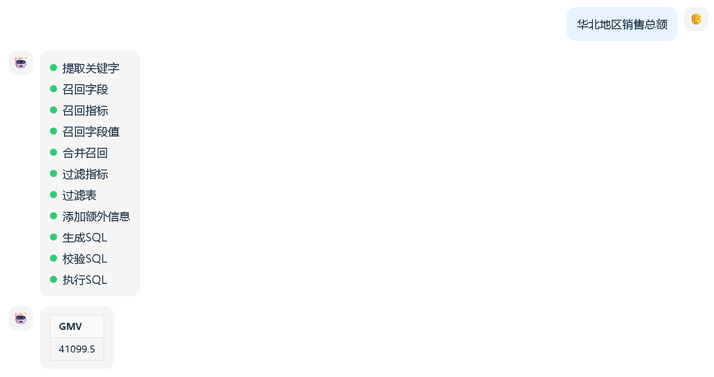

# 前后端联调

## 1. 启动前端项目

前端代码可从课程资料`date-agent-frontend`获取，另外启动项目需要node运行环境，node的安装包也可从课程资料获取。

在准备好node环境后，可在前端项目的根目录执行如下命令启动项目：

**注意**：node版本v22.22.0，资料中以提供该版本,也可以下载[NodeJS](https://nodejs.org/en/download)

安装项目所需依赖

```bash
npm install
```

启动项目

```bash
npm run dev
```

## 2. 解析前端解析数据

### 2.1. 端代码解析实现：

`date-agent-frontend\src\App.vue`

~~~javascript
  // 根据data不同字段更新流程步骤和消息列表
if (data.stage) {
  // 有阶段信息：更新最后一步为成功，新增当前运行阶段
  const last = steps.at(-1);
  if (last && last.status === "running") last.status = "success";
  steps.push({ text: data.stage, status: "running" });
} else if (data.error) {
  // 有错误信息：更新最后一步为失败，添加错误消息
  const last = steps.at(-1);
  if (last) last.status = "error";
  messages.value.push({
    role: "assistant",
    type: "error",
    content: data.error,
  });
} else if (Array.isArray(data.result)) {
  // 有数组结果：更新最后一步为成功，添加表格类型消息
  const last = steps.at(-1);
  if (last) last.status = "success";
  messages.value.push({
    role: "assistant",
    type: "table",
    columns: Object.keys(data.result[0] || {}),
    rows: data.result,
  });
}

~~~

### 2.2. 后端响应实现：

1）响应数据方式一：正确状态响应

~~~json
当前执行的阶段：
 {"stage":"抽取关键字"}

后端代码中实现：
    # 获取流式输出器
    writer = runtime.stream_writer
    # 输出进度状态信息
    writer({"stage":"添加额外上下文"})
~~~

2）响应数据方式一：异常状态响应

~~~json
当前执行的阶段：
 {"error":"异常信息内容"}
try:
  # 调用图流式输出
  async for chunk in graph.astream(input=state, context=context, stream_mode="custom"):
       yield f"data: {json.dumps(chunk,ensure_ascii=False,default=str)}\n\n"

except Exception as e:
       yield f"data: {json.dumps({"error":str(e)}, ensure_ascii=False, default=str)}\n\n"

~~~


3）响应数据方式三：统计结果响应

~~~json
统计结果:
{
  "result": [          // 顶层键：result，值为数组（列表）
    {                  // 数组第1个元素：地区对象
      "地区": "华南",
      "销售总额": 70202.0
    },
    {                  // 数组第2个元素：地区对象
      "地区": "华东",
      "销售总额": 107373.0
    },
    {                  // 数组第3个元素：地区对象
      "地区": "华北",
      "销售总额": 41099.5
    },
    {                  // 数组第4个元素：地区对象
      "地区": "西南",
      "销售总额": 31528.0
    },
    {                  // 数组第5个元素：地区对象
      "地区": "华中",
      "销售总额": 28957.0
    }
  ]
}

后端实现：
  # 解析处理结果
   execute_sql节点：
       writer({"result": result})

~~~

注意：在响应数据时需要对数据进行转换处理 

` json.dumps({"error":str(e)}, ensure_ascii=False, default=str)`

**json.dumps**：作用是将 Python 对象（如字典、列表）转换为 JSON 格式的字符串（序列化）

参数ensure_ascii=False：保留中文、表情等非 ASCII 字符的原始形态，不转义

参数default=str：如果 `chunk` 中包含 JSON 不支持的类型（如 datetime 时间对象、自定义类实例），会自动调用 									`str()` 把该对象转为字符串，避免抛出序列化异常


## 3. 访问前端页面

根据命令行输出访问问指定页面即可，具体效果如下：


